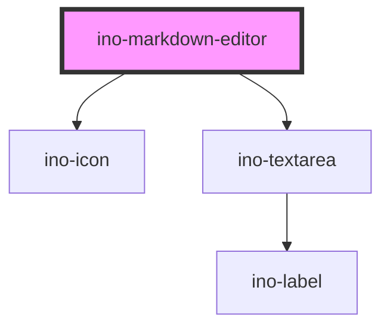

# ino-markdown-editor

<!-- Auto Generated Below -->

## Properties

| Property       | Attribute       | Description                                                                                                                                           | Type                                    | Default            |
| -------------- | --------------- | ----------------------------------------------------------------------------------------------------------------------------------------------------- | --------------------------------------- | ------------------ |
| `initialValue` | `initial-value` | Initial `string` value of the markdown editor. Reassigning this value do not change the editor state. The value must contain a valid Markdown syntax. | `string`                                | `undefined`        |
| `viewMode`     | `view-mode`     |                                                                                                                                                       | `ViewMode.MARKDOWN \| ViewMode.PREVIEW` | `ViewMode.PREVIEW` |

## Events

| Event            | Description                                                                                                      | Type                                                 |
| ---------------- | ---------------------------------------------------------------------------------------------------------------- | ---------------------------------------------------- |
| `valueChange`    | Emits when the value of the markdown editor **blurs**. The value of type `string` can be found in `event.detail` | `CustomEvent<string>`                                |
| `viewModeChange` | Emits when one of the view mode buttons was clicked. The value of type `ViewMode` can be found in `event.detail` | `CustomEvent<ViewMode.MARKDOWN \| ViewMode.PREVIEW>` |

## CSS Custom Properties

| Name                               | Description                                          |
| ---------------------------------- | ---------------------------------------------------- |
| `--ino-markdown-editor-max-height` | max-height of text editor Default value is `none`.   |
| `--ino-markdown-editor-min-height` | min-height of text editor. Default value is `100px`. |

## Dependencies

### Depends on

- [ino-icon](../ino-icon)
- [ino-textarea](../ino-textarea)

### Graph

----------------------------------------------

*Built with [StencilJS](https://stenciljs.com/)*
