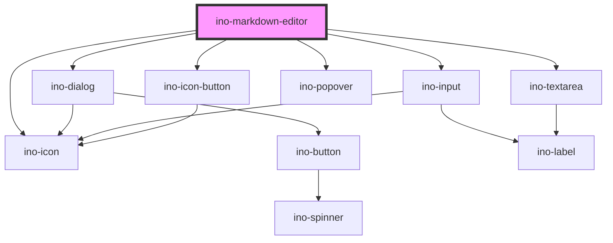

# ino-markdown-editor

<!-- Auto Generated Below -->

## Overview

The **Preview Mode** supports following actions:

| Actions ||||
|---|
| Link | Blockquotes | Unordered list / Bullet list | Headline 1 |
| Italic | Strikethrough | Ordered list / Numbered  list | Headline 2 |
| Bold | Inline code | Task list |

Additionally, there are a lot of predefined
[keyboard shortcuts](https://tiptap.dev/api/keyboard-shortcuts#predefined-keyboard-shortcuts)
provided by the underlying [tiptap](https://tiptap.dev/) editor.

The **Markdown Mode** supports all syntax of [CommonMark](https://commonmark.org/help/) with two exceptions:

 * Support of strikethrough syntax (`~~TextToStrike~~`)
 * Support of task list syntax (`- [x] MyToDoTask`)
 * No support of image syntax. __Images are not allowed!__

## Properties

| Property       | Attribute       | Description                                                                                                                                                                            | Type                                    | Default     |
| -------------- | --------------- | -------------------------------------------------------------------------------------------------------------------------------------------------------------------------------------- | --------------------------------------- | ----------- |
| `initialValue` | `initial-value` | Initial `string` value of the markdown editor. Reassigning this value do not change the editor state. The value must contain a valid Markdown syntax.                                  | `string`                                | `undefined` |
| `viewMode`     | `view-mode`     | Sets the view mode of the editor. Can be changed between `preview` (default), `markdown` and `readonly`. The `markdown` mode is made for advanced users that know the Markdown syntax. | `"markdown" \| "preview" \| "readonly"` | `'preview'` |

## Events

| Event            | Description                                                                                                      | Type                                                 |
| ---------------- | ---------------------------------------------------------------------------------------------------------------- | ---------------------------------------------------- |
| `inoBlur`        | Emits when the ino-markdown-editor is blurred                                                                    | `CustomEvent<void>`                                  |
| `valueChange`    | Emits when the value of the markdown editor **blurs**. The value of type `string` can be found in `event.detail` | `CustomEvent<string>`                                |
| `viewModeChange` | Emits when one of the view mode buttons was clicked. The value of type `ViewMode` can be found in `event.detail` | `CustomEvent<"markdown" \| "preview" \| "readonly">` |

## CSS Custom Properties

| Name                               | Description                           |
| ---------------------------------- | ------------------------------------- |
| `--ino-markdown-editor-max-height` | Max height of text editor. [size]     |
| `--ino-markdown-editor-min-height` | Min height of text editor. [size:100] |

## Dependencies

### Depends on

- [ino-dialog](../ino-dialog)
- [ino-input](../ino-input)
- [ino-icon-button](../ino-icon-button)
- [ino-icon](../ino-icon)
- [ino-popover](../ino-popover)
- [ino-textarea](../ino-textarea)

### Graph

----------------------------------------------

*Built with [StencilJS](https://stenciljs.com/)*
