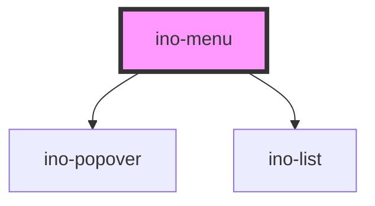

# ino-menu

A menu component that displays a list of choices on a temporary surface which opens and closes on anchor or item click.
The anchor element is the parent element.

The menu items consist of different variations of the `ino-list-item` component.

If you need a more customizable menu with a different type of elements or functionalities, have a look at the `ino-popover`.

### Usage

The component can be used as follows:

```html
<ino-button>
  <ino-menu>
    <ino-list-item ...></ino-list-item>
    <ino-list-divider></ino-list-divider>
  </ino-menu>
</ino-button>
```

### React

#### Example #1 - Basic

```jsx
import { Component } from 'react';
import {
  InoButton,
  InoMenu,
  InoListItem,
  InoDivider,
} from '@inovex.de/elements/dist/react';

class MyComponent extends Component {
  render() {
    return (
      <InoButton>
        Show Menu
        <InoMenu>
          <InoListItem text="Home"/>
          <InoListItem text="Projects"/>
          <InoDivider/>
          <InoListItem text="User"/>
          <InoListItem text="Settings"/>
        </InoMenu>
      </InoButton>
    );
  }
}
```

## Additional Hints

The menu creates a temporary surface with an empty list composer. The items of the list are provided via the slot (see
example above). For more details about the list capabilities itself, check the documentation of `ino-list`
and `ino-list-item` component.

<!-- Auto Generated Below -->


## Properties

| Property    | Attribute   | Description                                                                                                                                              | Type                                                                                                                                                                                                         | Default  |
| ----------- | ----------- | -------------------------------------------------------------------------------------------------------------------------------------------------------- | ------------------------------------------------------------------------------------------------------------------------------------------------------------------------------------------------------------ | -------- |
| `placement` | `placement` | Determines the position of the opened menu. Usually, the default value (`auto`) will work just fine. Use this if the positioning is off for some reason. | `"auto" \| "auto-end" \| "auto-start" \| "bottom" \| "bottom-end" \| "bottom-start" \| "left" \| "left-end" \| "left-start" \| "right" \| "right-end" \| "right-start" \| "top" \| "top-end" \| "top-start"` | `'auto'` |


## Dependencies

### Depends on

- [ino-popover](../ino-popover)
- [ino-list](../ino-list)

### Graph


----------------------------------------------

*Built with [StencilJS](https://stenciljs.com/)*
