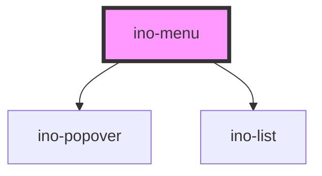

# ino-menu

<!-- Auto Generated Below -->

## Properties

| Property    | Attribute   | Description                                                                                                                                              | Type                                                                                                                                                                                                         | Default  |
| ----------- | ----------- | -------------------------------------------------------------------------------------------------------------------------------------------------------- | ------------------------------------------------------------------------------------------------------------------------------------------------------------------------------------------------------------ | -------- |
| `placement` | `placement` | Determines the position of the opened menu. Usually, the default value (`auto`) will work just fine. Use this if the positioning is off for some reason. | `"auto" \| "auto-end" \| "auto-start" \| "bottom" \| "bottom-end" \| "bottom-start" \| "left" \| "left-end" \| "left-start" \| "right" \| "right-end" \| "right-start" \| "top" \| "top-end" \| "top-start"` | `'auto'` |

## Slots

| Slot        | Description                                                                                                                                                                                                                                                                                                                                                                                                                                           |
| ----------- | ----------------------------------------------------------------------------------------------------------------------------------------------------------------------------------------------------------------------------------------------------------------------------------------------------------------------------------------------------------------------------------------------------------------------------------------------------- |
| `"default"` | One or more `ino-(control\|list\|nav)-item` and `ino-list-divider`  A menu component that displays a list of choices on a temporary surface which opens and closes on anchor or item click. The anchor element is the parent element.  The menu items consist of different variations of the `ino-list-item` component.  If you need a more customizable menu with a different type of elements or functionalities, have a look at the `ino-popover`. |

## Dependencies

### Depends on

- [ino-popover](../ino-popover)
- [ino-list](../ino-list)

### Graph

----------------------------------------------

*Built with [StencilJS](https://stenciljs.com/)*
