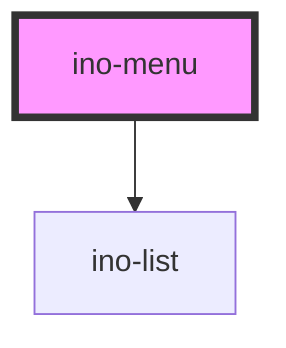

# ino-menu

A menu component that displays a list of choices on a temporary surface. It functions as a wrapper around the material [menu](https://github.com/material-components/material-components-web/blob/master/packages/mdc-menu/) component.
The anchor element is the element above.

### Usage

The component can be used as follows:

```html
<ino-menu ino-open ino-for="<string>">
  <ino-list-item ...></ino-list-item>
  <ino-list-divider></ino-list-divider>
</ino-menu>
```

### React

#### Example #1 - Basic

```js
import { Component } from 'react';
import {
  InoButton,
  InoMenu,
  InoListItem,
  InoDivider
} from '@inovex/elements/dist/react';

class MyComponent extends Component {
  render() {
    return (
      <InoMenu inoFor="menu">
        <InoListItem inoText="Home" />
        <InoListItem inoText="Projects" />
        <InoDivider />
        <InoListItem inoText="User" />
        <InoListItem inoText="Settings" />
      </InoMenu>
    );
  }
}
```

#### Example #2 - With Types

```js
import React, { Component } from 'react';
import {
  InoButton,
  InoMenu,
  InoListItem,
  InoDivider
} from '@inovex/elements/dist/react';
import { Components } from '@inovex/elements/dist/types/components';

const Menu: React.FunctionComponent<Components.InoMenuAttributes> = props => {
  const { inoFor } = props;

  return (
    <div>
      <InoButton id={inoFor}>Open menu</InoButton>
      <InoMenu inoFor={inoFor} inoOpen={true}>
        {props.children}
      </InoMenu>
    </div>
  );
};

class MyComponent extends Component {
  render() {
    return (
      <Menu inoFor="menu">
        <InoListItem inoText="Home" />
        <InoListItem inoText="Projects" />
        <InoDivider />
        <InoListItem inoText="User" />
        <InoListItem inoText="Settings" />
      </Menu>
    );
  }
}
```

## Additional Hints

The menu creates a temporary surface with an empty list composer. The items of this list are provided via the slot (see example above). For more details about the list capabilities itself, check the documentation of `ino-list` and `ino-list-item` component.

<!-- Auto Generated Below -->


## Properties

| Property  | Attribute  | Description                       | Type      | Default     |
| --------- | ---------- | --------------------------------- | --------- | ----------- |
| `inoFor`  | `ino-for`  | Anchor element for the menu       | `string`  | `undefined` |
| `inoOpen` | `ino-open` | Set this option to show the menu. | `boolean` | `false`     |


## Dependencies

### Depends on

- [ino-list](../ino-list)

### Graph


----------------------------------------------

*Built with [StencilJS](https://stenciljs.com/)*
