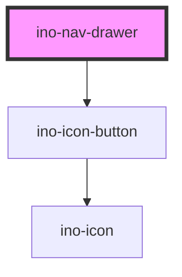

# ino-nav-drawer

<!-- Auto Generated Below -->

## Properties

| Property     | Attribute | Description                                                                                                                                      | Type                                                      | Default                                                                                                      |
| ------------ | --------- | ------------------------------------------------------------------------------------------------------------------------------------------------ | --------------------------------------------------------- | ------------------------------------------------------------------------------------------------------------ |
| `a11yLabels` | --        | The aria-labels used for content and footer nav elements. https://developer.mozilla.org/en-US/docs/Web/Accessibility/ARIA/Roles/navigation_role. | `{ content: string; footer: string; toggleBtn: string; }` | `{     content: 'Main Navigation',     footer: 'Footer Navigation',     toggleBtn: 'Toggle Navigation',   }` |
| `anchor`     | `anchor`  | Side from which the drawer will appear. Possible values: `left` (default), `right`.                                                              | `"left" \| "right"`                                       | `'left'`                                                                                                     |
| `open`       | `open`    | Marks this element as open. (**unmanaged**)                                                                                                      | `boolean`                                                 | `false`                                                                                                      |
| `variant`    | `variant` | The variant to use for the drawer.                                                                                                               | `"dismissible" \| "docked" \| "mobile" \| "modal"`        | `'docked'`                                                                                                   |

## Events

| Event        | Description                                                                                                           | Type                   |
| ------------ | --------------------------------------------------------------------------------------------------------------------- | ---------------------- |
| `openChange` | Emits when the user clicks on the drawer toggle icon to change the open state. Contains the status in `event.detail`. | `CustomEvent<boolean>` |

## Slots

| Slot         | Description                                                                                                                                                                                                                                                                                                                                                                                                   |
| ------------ | ------------------------------------------------------------------------------------------------------------------------------------------------------------------------------------------------------------------------------------------------------------------------------------------------------------------------------------------------------------------------------------------------------------- |
| `"app"`      | For the application located next to this nav-drawer  A navigation drawer component with different variants, setting up the base layout for your app. It functions as a wrapper around the material [drawer](https://github.com/material-components/material-components-web/blob/master/packages/mdc-drawer/) component.  > Note: The navigation drawer works best with `ino-list` and `ino-nav-item`s inside. |
| `"content"`  | For the content of the navigation bar (usually used with `ino-list` and `ino-nav-item`)                                                                                                                                                                                                                                                                                                                       |
| `"footer"`   | For elements below the content slot                                                                                                                                                                                                                                                                                                                                                                           |
| `"header"`   | For a custom header on top of the navigation bar                                                                                                                                                                                                                                                                                                                                                              |
| `"logo"`     | For the logo on top of the navigation bar (cannot be used with the `header` slot)                                                                                                                                                                                                                                                                                                                             |
| `"subtitle"` | For the element just below the logo (cannot be used with the `header` slot)                                                                                                                                                                                                                                                                                                                                   |

## Dependencies

### Depends on

- [ino-icon-button](../ino-icon-button)

### Graph

----------------------------------------------

*Built with [StencilJS](https://stenciljs.com/)*
