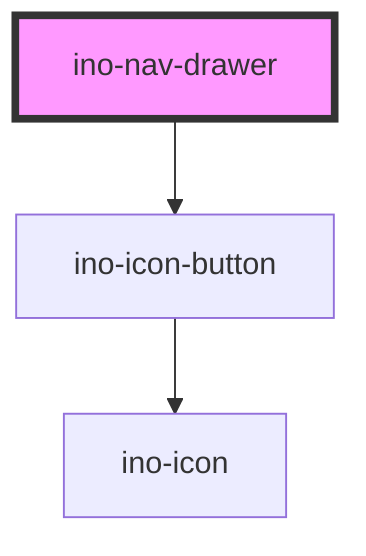

# ino-nav-drawer

<!-- Auto Generated Below -->

## Overview

A navigation drawer component designed to organize and facilitate user navigation in your app.
It functions as a wrapper around the material [drawer](https://github.com/material-components/material-components-web/blob/master/packages/mdc-drawer/) component.

Usage Note:
- This component is intended exclusively for navigation purposes. It is optimized for holding items like `ino-list` and `ino-nav-item` for effective user guidance.
- To maintain a clean and organized app structure, `ino-nav-drawer` should be used once per application. This ensures a consistent and predictable navigation experience across different parts of the app.

## Properties

| Property     | Attribute | Description                                                                                                                                      | Type                                                      | Default                                                                                                      |
| ------------ | --------- | ------------------------------------------------------------------------------------------------------------------------------------------------ | --------------------------------------------------------- | ------------------------------------------------------------------------------------------------------------ |
| `a11yLabels` | --        | The aria-labels used for content and footer nav elements. https://developer.mozilla.org/en-US/docs/Web/Accessibility/ARIA/Roles/navigation_role. | `{ content: string; footer: string; toggleBtn: string; }` | `{     content: 'Main Navigation',     footer: 'Footer Navigation',     toggleBtn: 'Toggle Navigation',   }` |
| `anchor`     | `anchor`  | Side from which the drawer will appear. Possible values: `left` (default), `right`.                                                              | `"left" \| "right"`                                       | `'left'`                                                                                                     |
| `open`       | `open`    | Marks this element as open. (**unmanaged**)                                                                                                      | `boolean`                                                 | `false`                                                                                                      |
| `variant`    | `variant` | The variant to use for the drawer.                                                                                                               | `"dismissible" \| "docked" \| "mobile" \| "modal"`        | `'docked'`                                                                                                   |

## Events

| Event        | Description                                                                                                           | Type                   |
| ------------ | --------------------------------------------------------------------------------------------------------------------- | ---------------------- |
| `openChange` | Emits when the user clicks on the drawer toggle icon to change the open state. Contains the status in `event.detail`. | `CustomEvent<boolean>` |

## Slots

| Slot         | Description                                                                                |
| ------------ | ------------------------------------------------------------------------------------------ |
| `"app"`      | For the application located next to this nav-drawer                                        |
| `"content"`  | For the content of the navigation drawer (usually used with `ino-list` and `ino-nav-item`) |
| `"footer"`   | For elements below the content slot                                                        |
| `"header"`   | For a custom header on top of the navigation drawer                                        |
| `"logo"`     | For the logo on top of the navigation drawer (cannot be used with the `header` slot)       |
| `"subtitle"` | For the element just below the logo (cannot be used with the `header` slot)                |

## CSS Custom Properties

| Name                                   | Description                                             |
| -------------------------------------- | ------------------------------------------------------- |
| `--ino-nav-drawer-background`          | Background of the drawer.                               |
| `--ino-nav-drawer-height`              | Height of the drawer.                                   |
| `--ino-nav-drawer-mobile-width-open`   | Mobile variant only! The width of the open drawer.      |
| `--ino-nav-drawer-text-color`          | Color of text inside the drawer.                        |
| `--ino-nav-drawer-timing-function`     | Timing function of the slide animation of the drawer.   |
| `--ino-nav-drawer-transition-duration` | Duration of the slide animation of the drawer.          |
| `--ino-nav-drawer-width-closed`        | Docked variant only! The width of the collapsed drawer. |
| `--ino-nav-drawer-width-open`          | The width of the open drawer.                           |

## Dependencies

### Depends on

- [ino-icon-button](../ino-icon-button)

### Graph

----------------------------------------------

*Built with [StencilJS](https://stenciljs.com/)*
