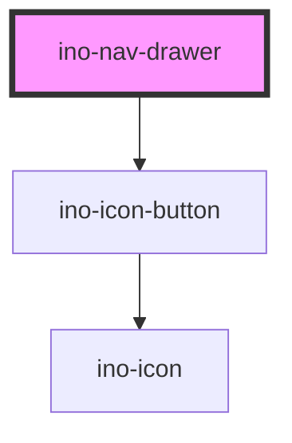

# ino-nav-drawer

A navigation drawer component with different variants, setting up the base layout for your app.
It functions as a wrapper around the material [drawer](https://github.com/material-components/material-components-web/blob/master/packages/mdc-drawer/) component.

> Note: The navigation drawer works best with `ino-list` and `ino-nav-item`s inside.

## Usage

The component can be used as follows:

### Web Component

```js
document
  .querySelector('ino-nav-drawer')
  .addEventListener('openChange', (_) => alert('Drawer was toggled!')) // watch for toggle change
  .setAttribute('open', true); // open drawer
```

```html
<ino-nav-drawer
  open="<boolean>"
  anchor="left|right"
  variant="docked|dismissible|modal"
>
  <ino-list slot="content">
    <ino-nav-item text="View1">
      <ino-icon icon="user">
    </ino-nav-item>
    <ino-nav-item text="View2">
      <ino-icon icon="settings">
    </ino-nav-item>
  </ino-list>

  <main slot="app">
    App Content
  </main>
</ino-nav-drawer>
```

### React

#### Example #1 - Basic

```js
import { Component } from 'react';
import { InoNavDrawer } from '@inovex.de/elements/dist/react';

class MyComponent extends Component {
  render() {
    return (
      <InoNavDrawer
        open="false"
        anchor="left"
        variant="docked"
        onOpen={(_) => alert('Yeah, you just opened the drawer!')}
      >
        <ino-list slot="header">
          <ino-img src="https://picsum.photos/50/50" />
        </ino-list>
        <ino-list slot="content">
          <ino-nav-item text="Some Link">
            <ino-icon icon="onboarding"></ino-icon>
          </ino-nav-item>
        </ino-list>
        <ino-list slot="footer">
          <ino-nav-item text="My Profile">
            <ino-img
              src="https://picsum.photos/id/1027/250/250.jpg"
              style="border-radius: 50%"
              ratio-width="1"
              ratio-height="1"
            ></ino-img>
          </ino-nav-item>
        </ino-list>

        <main slot="app">
          <App /> /* Your app goes here */
        </main>
      </InoNavDrawer>
    );
  }
}
```

#### Example #2 - With Types

```js
import React, { Component } from 'react';
import { InoNavDrawer } from '@inovex.de/elements/dist/react';
import { Components } from '@inovex.de/elements/dist/types/components';

const Drawer: React.FunctionComponent<Components.InoNavDrawerAttributes> = (
  props
) => {
  const { open, variant, anchor } = props;

  return (
    <InoNavDrawer open={open} variant={variant} onClick={onClick}>
      Drawer Content
      <main slot="app">App Content</main>
    </InoNavDrawer>
  );
};

class MyComponent extends Component {
  render() {
    return <Drawer variant="dismissible" anchor="left" open="true" />;
  }
}
```

## Demo

<!-- Auto Generated Below -->


## Properties

| Property  | Attribute | Description                                                                                    | Type                                   | Default    |
| --------- | --------- | ---------------------------------------------------------------------------------------------- | -------------------------------------- | ---------- |
| `anchor`  | `anchor`  | Side from which the drawer will appear. Possible values: `left` (default), `right`.            | `"left" \| "right"`                    | `'left'`   |
| `open`    | `open`    | Marks this element as open. (**unmanaged**)                                                    | `boolean`                              | `false`    |
| `variant` | `variant` | The variant to use for the drawer Possible values: `docked` (default), `dismissible`, `modal`. | `"dismissible" \| "docked" \| "modal"` | `'docked'` |


## Events

| Event        | Description                                                                                                           | Type                   |
| ------------ | --------------------------------------------------------------------------------------------------------------------- | ---------------------- |
| `openChange` | Emits when the user clicks on the drawer toggle icon to change the open state. Contains the status in `event.detail`. | `CustomEvent<boolean>` |


## Slots

| Slot         | Description                                                                             |
| ------------ | --------------------------------------------------------------------------------------- |
| `"app"`      | For the application located next to this nav-drawer                                     |
| `"content"`  | For the content of the navigation bar (usually used with `ino-list` and `ino-nav-item`) |
| `"footer"`   | For elements below the content slot                                                     |
| `"header"`   | For a custom header on top of the navigation bar                                        |
| `"logo"`     | For the logo on top of the navigation bar (cannot be used with the `header` slot)       |
| `"subtitle"` | For the element just below the logo (cannot be used with the `header` slot)             |


## Dependencies

### Depends on

- [ino-icon-button](../ino-icon-button)

### Graph


----------------------------------------------

*Built with [StencilJS](https://stenciljs.com/)*
