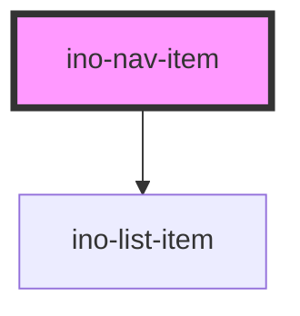

# ino-nav-item

A nav item component that displays a single instance of choice in a list or menu. It functions as a wrapper around the material [list item](https://github.com/material-components/material-components-web/blob/master/packages/mdc-list/) capabilities.

This component is used as child of `ino-list` and `ino-menu` components.

> Note: This component's main use case is within the `ino-nav-drawer`.

### Usage

The component can be used as follows:

```js
document
  .querySelector('ino-nav-item')
  .addEventListener('clickEl', (e) =>
    console.log(
      'The new nav-item was clicked, the element itself is:',
      e.detail,
    ),
  );
```

```html
<ino-nav-item ino-activated ino-text="<string>" onclickel="handleClickEl()">
  <ino-icon ...></ino-icon>
</ino-nav-item>
```

**Default:** Add an item with the default slot to add a first column in the nav item in LTR languages. Typically an icon or image.

<!-- Auto Generated Below -->


## Properties

| Property       | Attribute       | Description                                                                                                 | Type      | Default     |
| -------------- | --------------- | ----------------------------------------------------------------------------------------------------------- | --------- | ----------- |
| `inoActivated` | `ino-activated` | Styles the row in an activated style.  Use this for only one item and to mark it as permantently activated. | `boolean` | `false`     |
| `inoDisabled`  | `ino-disabled`  | Styles the row in a disabled style.                                                                         | `boolean` | `false`     |
| `inoText`      | `ino-text`      | The text of this list item.                                                                                 | `string`  | `undefined` |


## CSS Custom Properties

| Name                                     | Description                                   |
| ---------------------------------------- | --------------------------------------------- |
| `--ino-nav-item-background-color`        | Inactive color of the background of one item. |
| `--ino-nav-item-background-color-active` | Active color of the background of one item.   |
| `--ino-nav-item-color`                   | Inactive color of icon.                       |
| `--ino-nav-item-color-active`            | Active color of icon.                         |


## Dependencies

### Depends on

- [ino-list-item](../ino-list-item)

### Graph


----------------------------------------------

*Built with [StencilJS](https://stenciljs.com/)*
