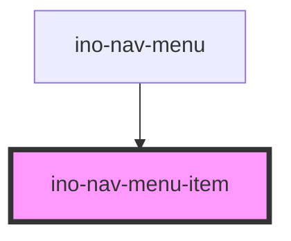

# ino-nav-menu-item

<!-- Auto Generated Below -->

## Properties

| Property                    | Attribute       | Description | Type      | Default     |
| --------------------------- | --------------- | ----------- | --------- | ----------- |
| `isActive`                  | `is-active`     |             | `boolean` | `false`     |
| `isLoading`                 | `is-loading`    |             | `boolean` | `false`     |
| `sectionId` _(required)_    | `section-id`    |             | `string`  | `undefined` |
| `sectionTitle` _(required)_ | `section-title` |             | `string`  | `undefined` |

## Events

| Event       | Description | Type                  |
| ----------- | ----------- | --------------------- |
| `itemClick` |             | `CustomEvent<string>` |

## Dependencies

### Used by

 - [ino-nav-menu](../ino-nav-menu)

### Graph

----------------------------------------------

*Built with [StencilJS](https://stenciljs.com/)*
