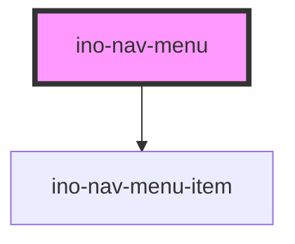

# ino-nav-menu

<!-- Auto Generated Below -->

## Overview

A sticky navigation menu or sidebar that dynamically lists the names of sections present
on the current page. Each section must be constructed using the `ino-nav-menu-section` component.
When a user selects a section from the navigation menu by clicking its name, the corresponding
section will smoothly scroll into the viewport, and vice versa.

The selected or active section must be handled outside of the component using the property
`activeSection` and the event `activeSectionChanged` as described below.

## Properties

| Property                     | Attribute               | Description                                                                                                                                                                                                                                                                                                                                                                                               | Type                       | Default                    |
| ---------------------------- | ----------------------- | --------------------------------------------------------------------------------------------------------------------------------------------------------------------------------------------------------------------------------------------------------------------------------------------------------------------------------------------------------------------------------------------------------- | -------------------------- | -------------------------- |
| `activeSection`              | `active-section`        | To specify the selected section, utilize the `buildSectionId` helper function to generate a unique section ID based on the section name if no ID was specified. This ID must be provided when configuring the component. The section ID can be set to null if no section should be selected initially or when operating in autodetect mode (means no sections provided).  TODO: rename to activeSectionId | `string`                   | `undefined`                |
| `intersectionObserverConfig` | --                      | Config of the internal intersection observer.                                                                                                                                                                                                                                                                                                                                                             | `IntersectionObserverInit` | `DEFAULT_OBSERVER_OPTIONS` |
| `loading`                    | `loading`               | Overrides the `ino-nav-menu`'s loading animation behavior. When set to true, the loading animation is displayed indefinitely. When set to false, the `ino-nav-menu` will not show any loading animations.  By default, the loading animation will be shown only during the section-fetching/autodetection process.                                                                                        | `boolean`                  | `true`                     |
| `menuTitle` _(required)_     | `menu-title`            | Title of the navigation menu.                                                                                                                                                                                                                                                                                                                                                                             | `string`                   | `undefined`                |
| `scrollOffset`               | `scroll-offset`         | Scroll offset of the sticky navigation menu.                                                                                                                                                                                                                                                                                                                                                              | `number`                   | `DEFAULT_SCROLL_OFFSET`    |
| `sectionsContainerId`        | `sections-container-id` | ID of the container which holds the `ino-nav-menu-section` elements. If no `sectionsContainerId` is provided, the component will automatically look up all `ino-nav-menu-section` in the body.                                                                                                                                                                                                            | `string`                   | `undefined`                |

## Events

| Event                  | Description                                                                                                                                                        | Type                  |
| ---------------------- | ------------------------------------------------------------------------------------------------------------------------------------------------------------------ | --------------------- |
| `activeSectionChanged` | Emits the section ID when the corresponding section is selected by scrolling into the viewport. This event can be utilized to update the `activeSection` property. | `CustomEvent<string>` |

## Methods

### `reInitSections() => Promise<void>`

Use to manually inflict another initiation of the sections and their observers

#### Returns

Type: `Promise<void>`

## Dependencies

### Depends on

- [ino-nav-menu-item](../ino-nav-menu-item)

### Graph

----------------------------------------------

*Built with [StencilJS](https://stenciljs.com/)*
