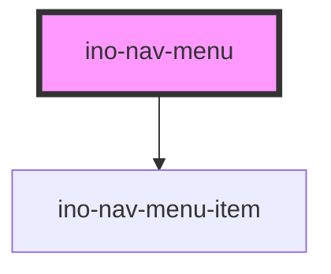

# ino-nav-menu

<!-- Auto Generated Below -->

## Overview

A sticky navigation menu or sidebar that dynamically lists the names of sections present
on the current page. Each section must be constructed using the `ino-nav-menu-section` component.
When a user selects a section from the navigation menu by clicking its name, the corresponding
section will smoothly scroll into the viewport, and vice versa.

## Properties

| Property                     | Attribute               | Description                                                                                                                                                                                    | Type                       | Default                    |
| ---------------------------- | ----------------------- | ---------------------------------------------------------------------------------------------------------------------------------------------------------------------------------------------- | -------------------------- | -------------------------- |
| `intersectionObserverConfig` | --                      | Config of the internal intersection observer.                                                                                                                                                  | `IntersectionObserverInit` | `DEFAULT_OBSERVER_OPTIONS` |
| `menuTitle` _(required)_     | `menu-title`            | Title of the navigation menu.                                                                                                                                                                  | `string`                   | `undefined`                |
| `sectionsContainerId`        | `sections-container-id` | ID of the container which holds the `ino-nav-menu-section` elements. If no `sectionsContainerId` is provided, the component will automatically look up all `ino-nav-menu-section` in the body. | `string`                   | `undefined`                |

## Events

| Event                 | Description                                                                                                                                                                                              | Type                  |
| --------------------- | -------------------------------------------------------------------------------------------------------------------------------------------------------------------------------------------------------- | --------------------- |
| `activeSectionChange` | Emitted when the active section within the navigation menu changes. This event provides the ID of the newly active section. Can be used for syncing the currently active element to the hash of the URL. | `CustomEvent<string>` |

## Methods

### `scrollToSection(sectionId: string, behavior?: ScrollBehavior, topOffset?: number) => Promise<void>`

Programmatically scrolls to the specified section within the navigation sections.

#### Parameters

| Name        | Type                              | Description                                                                                                                                     |
| ----------- | --------------------------------- | ----------------------------------------------------------------------------------------------------------------------------------------------- |
| `sectionId` | `string`                          | The ID of the section to scroll to.                                                                                                             |
| `behavior`  | `"auto" \| "instant" \| "smooth"` | (Optional) The scrolling behavior (see [MDN](https://developer.mozilla.org/en-US/docs/Web/API/Window/scrollTo#behavior)). Defaults to 'smooth'. |
| `topOffset` | `number`                          | (Optional) The top offset applied during scrolling to adjust the final position. Defaults to 80 pixels.                                         |

#### Returns

Type: `Promise<void>`

## Dependencies

### Depends on

- [ino-nav-menu-item](../ino-nav-menu-item)

### Graph

----------------------------------------------

*Built with [StencilJS](https://stenciljs.com/)*
