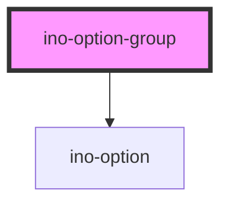

# ino-option-group
A wrapper component to be used for a group of ino-options. This component adds a non-selectable header before the options.

Beyond that, if you encounter problems using React or Vue in conjunction with the `ino-select`, use this component as a wrapper around your `ino-option`. This way the virtual DOM will know when to update the `ino-select` and its children, which may otherwise not work properly if the options are added dynamically while deeply nested in the `ino-select'. For more information refer to [this issue](https://github.com/ionic-team/stencil/issues/2259).

### Usage

```html
<ino-select>
    <ino-option-group ino-label="My First Option Group">
      <ino-option value="Option 1">Option 1</ino-option>
      <ino-option value="Option 2">Option 2</ino-option>
      <ino-option value="Option 3">Option 3</ino-option>
    </ino-option-group>
    <ino-option-group ino-label="My Second Option Group">
      <ino-option value="Option 4">Option 4</ino-option>
      <ino-option value="Option 5">Option 5</ino-option>
      <ino-option value="Option 6">Option 6</ino-option>
    </ino-option-group>
</ino-select>
```

### React

#### Example

```js
import { Component } from 'react';
import { InoSelect, InoOption, InoOptionGroup } from '@inovex.de/elements-react/dist';

class MyComponent extends Component {

  state = {
    selected: 'Option 1'
  } ;
  
  changeHandler = (value) => {
    this.setState({selected: value});
  };

  render() {
    return (
        <InoSelect inoLabel="My Select" value={this.state.selected} onValueChange={() => this.changeHandler(e.detail)}>
          <InoOptionGroup inoLabel={"Option Group 1"}>
              <InoOption value="Option 1">Option 1</InoOption>
              <InoOption value="Option 2">Option 2</InoOption>
          </InoOptionGroup>
          <InoOptionGroup inoLabel={"Option Group 2"}>
              <InoOption value="Option 3">Option 3</InoOption>
              <InoOption value="Option 4">Option 4</InoOption>
          </InoOptionGroup>
        </InoSelect>
    );
  }
}
```


<!-- Auto Generated Below -->


## Properties

| Property   | Attribute   | Description                                                                                                                                                                                                                                                               | Type     | Default     |
| ---------- | ----------- | ------------------------------------------------------------------------------------------------------------------------------------------------------------------------------------------------------------------------------------------------------------------------- | -------- | ----------- |
| `inoLabel` | `ino-label` | Label of the group. If not set, this component serves as a wrapper component for dynamically added `ino-options`. When using react and vue, an issue exists with slots and the virtual DOM. Read more about it [here](https://github.com/ionic-team/stencil/issues/2259). | `string` | `undefined` |


## Dependencies

### Depends on

- [ino-option](../ino-option)

### Graph


----------------------------------------------

*Built with [StencilJS](https://stenciljs.com/)*
