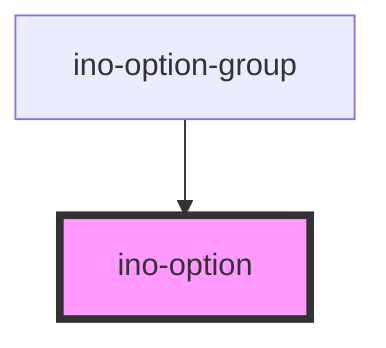

# ino-option

<!-- Auto Generated Below -->

## Overview

An option component that can be used to add options to an ino-select component.

## Properties

| Property             | Attribute  | Description         | Type      | Default     |
| -------------------- | ---------- | ------------------- | --------- | ----------- |
| `disabled`           | `disabled` | Disables the option | `boolean` | `false`     |
| `selected`           | `selected` | Selects the option  | `boolean` | `false`     |
| `value` _(required)_ | `value`    | Value of the option | `string`  | `undefined` |

## Events

| Event     | Description           | Type                                |
| --------- | --------------------- | ----------------------------------- |
| `clickEl` | Emits on option click | `CustomEvent<HTMLInoOptionElement>` |

## Slots

| Slot        | Description            |
| ----------- | ---------------------- |
| `"default"` | The text of the option |

## CSS Custom Properties

| Name                                              | Description                                              |
| ------------------------------------------------- | -------------------------------------------------------- |
| `--ino-option-deselected-background-color`        | Background color if deselected. [color:#fff]             |
| `--ino-option-deselected-background-color-active` | Background color if active and deselected. [color:#fff]  |
| `--ino-option-deselected-background-color-focus`  | Background color on focus if deselected. [color:#f4f4f7] |
| `--ino-option-deselected-background-color-hover`  | Background color on hover if deselected. [color:#f4f4f7] |
| `--ino-option-height`                             | Height of the option container. [size:2.85:rem]          |
| `--ino-option-selected-background-color`          | Background color if selected. [color:#f6fafe]            |
| `--ino-option-selected-background-color-active`   | Background color if active and selected. [color:#beccff] |
| `--ino-option-selected-background-color-focus`    | Background color on focus if selected. [color:#e2ecff]   |
| `--ino-option-selected-background-color-hover`    | Background color on hover if selected. [color:#e2ecff]   |

## Dependencies

### Used by

 - [ino-option-group](../ino-option-group)

### Graph

----------------------------------------------

*Built with [StencilJS](https://stenciljs.com/)*
