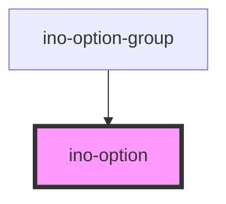

# ino-option

An option component that can be used to add options to an ino-select component.

### Usage

The component can be used as follows:

```html
<ino-option
    disabled
    selected
    value="<string>"
>
   Content
</ino-option>
```


<!-- Auto Generated Below -->


## Properties

| Property             | Attribute  | Description         | Type      | Default     |
| -------------------- | ---------- | ------------------- | --------- | ----------- |
| `disabled`           | `disabled` | Disables the option | `boolean` | `false`     |
| `selected`           | `selected` | Selects the option  | `boolean` | `false`     |
| `value` _(required)_ | `value`    | Value of the option | `string`  | `undefined` |


## CSS Custom Properties

| Name                                   | Description                |
| -------------------------------------- | -------------------------- |
| `--ino-option-background-color`        | background color           |
| `--ino-option-background-color-active` | background color if active |
| `--ino-option-background-color-focus`  | background color on focus  |
| `--ino-option-background-color-hover`  | background color on hover  |


## Dependencies

### Used by

 - [ino-option-group](../ino-option-group)

### Graph


----------------------------------------------

*Built with [StencilJS](https://stenciljs.com/)*
