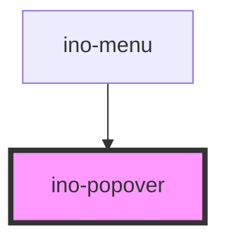

# ino-popover

A Popover is a dialog which is bound to a specific element and appears next to it. Under the
hood, [tippy.js](https://atomiks.github.io/tippyjs/) is used.

The Popover
and [Tooltip](https://elements.inovex.de/dist/latest/storybook/?path=/story/notification-ino-tooltip--default-usage)
components are very similar. However, popovers are complex dialogs consisting of several HTML elements, while tooltips
can only display plain text.

### Usage

The component can be used as follows:

```html

<ino-popover
  ino-color-scheme="<string>"
  ino-controlled="<boolean>"
  ino-distance="<number>"
  ino-for="<string>"
  ino-interactive="<boolean>"
  ino-placement="<string>" 
  ino-trigger="<string>"
  ino-visible="<boolean>"
>
  Any desired HTML
</ino-popover>
```

#### Targets
There are currently three ways to attach your popover to a component, which results in a slightly different structure:

1. Using the `ino-popover-trigger` slot _(preferred)_:
```html
<ino-popover ino-trigger="click">
    <ino-button slot="ino-popover-trigger">Click to show/hide</ino-button>
    <custom-html-content></custom-html-content>
</ino-popover>
```
```html
<ino-popover>
├── <ino-button>
└── <custom-html-content>
```

2. Using the `ino-for` property:
```html
<ino-button id="my-target" slot="ino-popover-trigger">Click to show/hide</ino-button>
<ino-popover ino-for="my-target" ino-trigger="click">
  <custom-html-content></custom-html-content>
</ino-popover>
```
```html
<ino-button>
<ino-popover>
└── <custom-html-content>
```

3. Using the parent element:
```html
<ino-button>
    Click to show/hide
    <ino-popover ino-trigger="click">
      <custom-html-content></custom-html-content>
    </ino-popover>
</ino-button>
```
```html
<ino-button>
└── <ino-popover>
    └── <custom-html-content>
```


#### Controlled vs. Uncontrolled

There are currently two ways you can manage the state of the popover.

_Uncontrolled_

Either you use the `ino-trigger` property to define the method when the popover should be opened or closed (e.g. hovering in opens and hovering out closes the popover). 
This is the easiest way as you don't have to worry about managing this state yourself.

```jsx
// ...

class MyComponent extends Component {
  render() {
    return (
      <div>
        <InoPopover inoTrigger="mouseenter">
          <InoButton slot="ino-popover-trigger">Open Popover</InoButton>
          This popover will show as soon as the user hovers the button above
        </InoPopover>
      </div>
    );
  }
}
```

_Controlled_

Or you use the `ino-controlled` and `ino-visible` property to show/hide the popover by yourself. 
This is helpful if you want to implement custom logic when the popover should be shown or hidden.

```typescript jsx
// ...

class MyComponent extends Component {

  state = {
    showPopover: false
  };

  setPopoverState = (show: boolean) => {
    if (this.props.someProp) return; // Some condition
    
    this.setState({ showPopover: show });
  }

  render() {
    return (
      <div>
        <InoPopover 
          inoControlled 
          inoVisible={this.state.showPopover}
          onInoVisibleChanged={(e) => setPopoverState(e.detail)}
        >
          <InoButton slot="ino-popover-trigger">
            Open Popover
          </InoButton>
          This popover will show as soon as the user clicks the button above
        </InoPopover>
      </div>
    );
  }
}
```

### React

#### Example #1 - Basic

```jsx
import { Component } from 'react';
import { InoPopover } from '@inovex.de/elements/dist/react';

class MyComponent extends Component {
  render() {
    return (
      <InoPopover inoPlacement="left" inoFor="popover-positions-target">
        This is a simple popover on the left
      </InoPopover>
    );
  }
}
```

#### Example #2 - With Types

```typescript jsx
import React, { Component } from 'react';
import { InoPopover } from '@inovex.de/elements/dist/react';
import { Components } from '@inovex.de/elements/dist/types/components';

const Popover: React.FunctionComponent<Components.InoPopoverAttributes> = (
  props,
) => {
  const { inoPlacement, inoFor } = props;

  return (
    <InoPopover inoPlacement={inoPlacement} inoFor={inoFor}>
      {props.children}
    </InoPopover>
  );
};

class MyComponent extends Component {
  render() {
    return (
      <Popover inoPlacement="left" inoFor="popover-positions-target">
        This is a simple popover on the left
      </Popover>
    );
  }
}
```

## Additional Hints

<!-- Auto Generated Below -->


## Properties

| Property         | Attribute          | Description                                                                                                                                                                                             | Type                                                                                                                                                                                                                                                                                                                                   | Default              |
| ---------------- | ------------------ | ------------------------------------------------------------------------------------------------------------------------------------------------------------------------------------------------------- | -------------------------------------------------------------------------------------------------------------------------------------------------------------------------------------------------------------------------------------------------------------------------------------------------------------------------------------- | -------------------- |
| `inoColorScheme` | `ino-color-scheme` | Sets the color scheme of the popup Valid options include: 'primary', 'secondary', 'light', 'transparent'                                                                                                | `string`                                                                                                                                                                                                                                                                                                                               | `'primary'`          |
| `inoControlled`  | `ino-controlled`   | Used to indicate if the popover should be controlled by itself (`false`) or manually by the `ino-visible` property (`true`)                                                                             | `boolean`                                                                                                                                                                                                                                                                                                                              | `false`              |
| `inoDistance`    | `ino-distance`     | Displaces the popover away from, or toward, the anchor element in the direction of its placement. A positive number displaces it further away, while a negative number lets it overlap the anchor.      | `number`                                                                                                                                                                                                                                                                                                                               | `10`                 |
| `inoFor`         | `ino-for`          | The target id the popover belongs to. If not given, the popover is attached to the element provided in the named slot (`ino-popover-trigger`) or the parent component if a slot element does not exist. | `string`                                                                                                                                                                                                                                                                                                                               | `undefined`          |
| `inoInteractive` | `ino-interactive`  | Use this if you want to interact with the popover content (e.g. button clicks)                                                                                                                          | `boolean`                                                                                                                                                                                                                                                                                                                              | `false`              |
| `inoPlacement`   | `ino-placement`    | The placement of this popover. Accepted values: `top(-start, -end)`, `right(-start, -end)`, `bottom(-start, -end)`, `left(-start, -end)`                                                                | `"auto" \| "auto-end" \| "auto-start" \| "bottom" \| "bottom-end" \| "bottom-start" \| "left" \| "left-end" \| "left-start" \| "right" \| "right-end" \| "right-start" \| "top" \| "top-end" \| "top-start"`                                                                                                                           | `'auto'`             |
| `inoTrigger`     | `ino-trigger`      | The trigger to show the tooltip - either click, hover or focus. Multiple triggers are possible by separating them with a space.                                                                         | `"click focus mouseenter" \| "click focus" \| "click mouseenter focus" \| "click mouseenter" \| "click" \| "focus click mouseenter" \| "focus click" \| "focus mouseenter click" \| "focus mouseenter" \| "focus" \| "mouseenter click focus" \| "mouseenter click" \| "mouseenter focus click" \| "mouseenter focus" \| "mouseenter"` | `'mouseenter focus'` |
| `inoVisible`     | `ino-visible`      | Programmatically show or hide the popover. Can only be used in controlled mode (see property `ino-controlled`). Use the `inoVisibleChanged` to sync the popovers' visibility state with yours.          | `boolean`                                                                                                                                                                                                                                                                                                                              | `false`              |


## Events

| Event               | Description                                                                                                                                                                                                                                                                                                                                                                           | Type                   |
| ------------------- | ------------------------------------------------------------------------------------------------------------------------------------------------------------------------------------------------------------------------------------------------------------------------------------------------------------------------------------------------------------------------------------- | ---------------------- |
| `inoVisibleChanged` | Emits when the popover wants to show (`true`) or hide (`false`) itself. This is depended on the `ino-trigger` property. Use this event in controlled-mode (see `ino-controlled`).  e.g.: `ino-trigger = 'click'` - This events emits with `true` when the user clicks on the target (slot/`ino-for`/parent-element) and emits with `false` when the target or the outside is clicked. | `CustomEvent<boolean>` |


## Methods

### `getTippyInstance() => Promise<any>`

Returns the internally used tippy.js instance
For more informations see: https://atomiks.github.io/tippyjs/

#### Returns

Type: `Promise<any>`


## Slots

| Slot                    | Description                                  |
| ----------------------- | -------------------------------------------- |
| `"ino-popover-trigger"` | The target element to attach the triggers to |


## Dependencies

### Used by

 - [ino-menu](../ino-menu)

### Graph


----------------------------------------------

*Built with [StencilJS](https://stenciljs.com/)*
