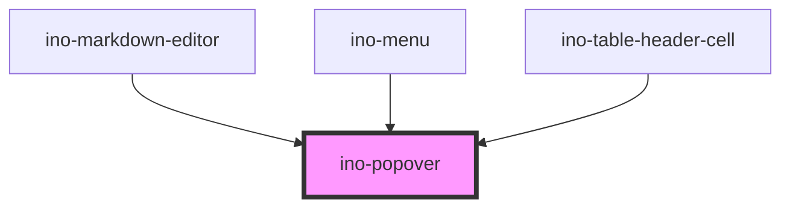

# ino-popover

<!-- Auto Generated Below -->

## Overview

A Popover is a dialog which is bound to a specific element and appears next to it. Under the
hood, [tippy.js](https://atomiks.github.io/tippyjs/) is used.

The Popover
and [Tooltip](https://elements.inovex.de/dist/latest/storybook/?path=/story/notification-ino-tooltip--default-usage)
components are very similar. However, popovers are complex dialogs consisting of several HTML elements, while tooltips
can only display plain text.

## Properties

| Property       | Attribute        | Description                                                                                                                                                                                                                                                              | Type                                                                                                                                                                                                                                                                                                                                   | Default              |
| -------------- | ---------------- | ------------------------------------------------------------------------------------------------------------------------------------------------------------------------------------------------------------------------------------------------------------------------ | -------------------------------------------------------------------------------------------------------------------------------------------------------------------------------------------------------------------------------------------------------------------------------------------------------------------------------------- | -------------------- |
| `arrow`        | `arrow`          | Shows an arrow pointing towards its trigger-element                                                                                                                                                                                                                      | `boolean`                                                                                                                                                                                                                                                                                                                              | `false`              |
| `attachToBody` | `attach-to-body` | If set, attaches the popover element to the body. Useful to avoid overflow or z-index issues.                                                                                                                                                                            | `boolean`                                                                                                                                                                                                                                                                                                                              | `false`              |
| `colorScheme`  | `color-scheme`   | Sets the color scheme of the popup.  Valid options include: `primary`, `light` and `dark`.                                                                                                                                                                               | `"dark" \| "light" \| "primary" \| "transparent"`                                                                                                                                                                                                                                                                                      | `'primary'`          |
| `controlled`   | `controlled`     | Used to indicate if the popover should be controlled by itself (`false`) or manually by the `visible` property (`true`)                                                                                                                                                  | `boolean`                                                                                                                                                                                                                                                                                                                              | `false`              |
| `delay`        | `delay`          | The delay in milliseconds before `ino-popover` shows up or hides.  If only one number is given, the show and hide delay get the given delay duration.  If two numbers are given e.g. `[500, 200]` the show delay is 500ms and the hide delay is 200ms.  Defaults to 0ms. | `[number, number] \| number`                                                                                                                                                                                                                                                                                                           | `0`                  |
| `distance`     | `distance`       | Displaces the popover away from, or toward, the anchor element in the direction of its placement. A positive number displaces it further away, while a negative number lets it overlap the anchor.                                                                       | `number`                                                                                                                                                                                                                                                                                                                               | `10`                 |
| `followCursor` | `follow-cursor`  | Determines if and how the popover follows the user's mouse cursor.                                                                                                                                                                                                       | `"horizontal" \| "initial" \| "vertical" \| boolean`                                                                                                                                                                                                                                                                                   | `false`              |
| `for`          | `for`            | The target id the popover belongs to. If not given, the popover is attached to the element provided in the named slot (`popover-trigger`) or the parent component if a slot element does not exist.                                                                      | `string`                                                                                                                                                                                                                                                                                                                               | `undefined`          |
| `hideOnBlur`   | `hide-on-blur`   | If true, hides the popper on blur.                                                                                                                                                                                                                                       | `boolean`                                                                                                                                                                                                                                                                                                                              | `false`              |
| `hideOnEsc`    | `hide-on-esc`    | If true, hides the popper on esc.                                                                                                                                                                                                                                        | `boolean`                                                                                                                                                                                                                                                                                                                              | `false`              |
| `interactive`  | `interactive`    | Use this if you want to interact with the popover content (e.g. button clicks)                                                                                                                                                                                           | `boolean`                                                                                                                                                                                                                                                                                                                              | `false`              |
| `placement`    | `placement`      | The placement of this popover. Accepted values: `top(-start, -end)`, `right(-start, -end)`, `bottom(-start, -end)`, `left(-start, -end)`                                                                                                                                 | `"auto" \| "auto-end" \| "auto-start" \| "bottom" \| "bottom-end" \| "bottom-start" \| "left" \| "left-end" \| "left-start" \| "right" \| "right-end" \| "right-start" \| "top" \| "top-end" \| "top-start"`                                                                                                                           | `'auto'`             |
| `trigger`      | `trigger`        | The trigger to show the tooltip - either click, hover or focus. Multiple triggers are possible by separating them with a space.                                                                                                                                          | `"click focus mouseenter" \| "click focus" \| "click mouseenter focus" \| "click mouseenter" \| "click" \| "focus click mouseenter" \| "focus click" \| "focus mouseenter click" \| "focus mouseenter" \| "focus" \| "mouseenter click focus" \| "mouseenter click" \| "mouseenter focus click" \| "mouseenter focus" \| "mouseenter"` | `'mouseenter focus'` |
| `visible`      | `visible`        | Programmatically show or hide the popover. Can only be used in controlled mode (see property `controlled`). Use the `visibleChanged` to sync the popovers' visibility state with yours.                                                                                  | `boolean`                                                                                                                                                                                                                                                                                                                              | `false`              |

## Events

| Event            | Description                                                                                                                                                                                                                                                                                                                                                           | Type                   |
| ---------------- | --------------------------------------------------------------------------------------------------------------------------------------------------------------------------------------------------------------------------------------------------------------------------------------------------------------------------------------------------------------------- | ---------------------- |
| `visibleChanged` | Emits when the popover wants to show (`true`) or hide (`false`) itself. This is depended on the `trigger` property. Use this event in controlled-mode (see `controlled`).  e.g.: `trigger = 'click'` - This events emits with `true` when the user clicks on the target (slot/`for`/parent-element) and emits with `false` when the target or the outside is clicked. | `CustomEvent<boolean>` |

## Methods

### `getTippyInstance() => Promise<any>`

Returns the internally used tippy.js instance
For more informations see: https://atomiks.github.io/tippyjs/

#### Returns

Type: `Promise<any>`

## Slots

| Slot                | Description                                  |
| ------------------- | -------------------------------------------- |
| `"default"`         | Content of the popover                       |
| `"popover-trigger"` | The target element to attach the triggers to |

## Dependencies

### Used by

 - [ino-markdown-editor](../ino-markdown-editor)
 - [ino-menu](../ino-menu)
 - [ino-table-header-cell](../ino-table-header-cell)

### Graph

----------------------------------------------

*Built with [StencilJS](https://stenciljs.com/)*
