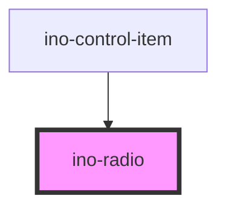

# ino-radio

A radio component that allows the user to select an option from a set of radio-buttons. In order to have a single select functionality, please refer to the `ino-radio-group`-component. This component functions as a wrapper around the material [radio](https://github.com/material-components/material-components-web/tree/master/packages/mdc-radio) component.

### Usage

The component can be used as follows:

```js
document
  .querySelector('ino-radio')
  .addEventListener('checkedChange', (_) =>
    alert(`The radio button should be checked`),
  );
```

```html
<ino-radio
  checked="<boolean>"
  disabled="<boolean>"
  name="<string>"
  value="<string>"
  ino-id="<string>"
  oncheckedChange="handleCheckedChange()"
>
  Label
</ino-radio>
```

### React

#### Example #1 - Basic

```js
import { Component } from 'react';
import { InoRadio } from '@inovex.de/elements/dist/react';

class MyComponent extends Component {
  render() {
    return (
      <InoRadio checked name="radio-1">
        Checked
      </InoRadio>
    );
  }
}
```

#### Example #2 - With Types

```js
import React, { Component } from 'react';
import { InoRadio } from '@inovex.de/elements/dist/react';
import { Components } from '@inovex.de/elements/dist/types/components';

const Radio: React.FunctionComponent<Components.InoRadioAttributes> = (
  props,
) => {
  const { checked, name } = props;

  return (
    <InoRadio checked={checked} name={name}>
      {props.children}
    </InoRadio>
  );
};

class MyComponent extends Component {
  render() {
    return (
      <Radio checked name="radio-1">
        Checked
      </Radio>
    );
  }
}
```

## Additional Hints

### Control flow

Clicking on the radio button triggers an event that contains the boolean value `true` (`e.detail`). This event is only triggered if the radio button was not previously selected (`checked=false`). In order to check one element and uncheck the other ones, please refer to the `ino-radio-group`-Component. If (`checked=true`) is passed to an element, the other elements **won't** be deselected without the use of the `ino-radio-group`.

```html
<ino-radio
  checked={this.state.checked}
  checkedChange={e => this.state.checked = e.detail}>
</ino-radio>
```

## Demo

<!-- Auto Generated Below -->

## Properties

| Property   | Attribute  | Description                                                                                                                                                | Type      | Default     |
| ---------- | ---------- | ---------------------------------------------------------------------------------------------------------------------------------------------------------- | --------- | ----------- |
| `checked`  | `checked`  | Initially marks this element as checked. If another ino-radio element in the same group receives `true`, the value will be changed to false automatically. | `boolean` | `false`     |
| `disabled` | `disabled` | Disables this element.                                                                                                                                     | `boolean` | `undefined` |
| `name`     | `name`     | The name of this element. Use the same name for radio groups                                                                                               | `string`  | `undefined` |
| `value`    | `value`    | The value of this element.                                                                                                                                 | `string`  | `undefined` |

## Events

| Event           | Description                                                                                                                                                                | Type               |
| --------------- | -------------------------------------------------------------------------------------------------------------------------------------------------------------------------- | ------------------ |
| `checkedChange` | Emits when the user interacts with the radio-button. Contains `true` in `event.detail`. This event will only be emitted if the current state of the radio button is false. | `CustomEvent<any>` |

## CSS Custom Properties

| Name                                      | Description                           |
| ----------------------------------------- | ------------------------------------- |
| `--ino-radio-active-color`                | color of the radio if active          |
| `--ino-radio-checked-color`               | color of the radio if checked         |
| `--ino-radio-disabled-inner-circle-color` | color of the inner circle if disabled |
| `--ino-radio-disabled-outer-circle-color` | color of the outer circle if disabled |
| `--ino-radio-hover-color`                 | color of the radio on hover           |
| `--ino-radio-unchecked-color`             | color of the radio if unchecked       |

## Dependencies

### Used by

- [ino-control-item](../ino-control-item)

### Graph



---

_Built with [StencilJS](https://stenciljs.com/)_
