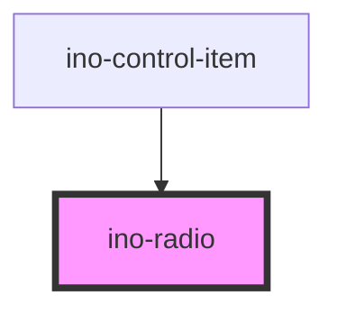

# ino-radio

<!-- Auto Generated Below -->

## Properties

| Property   | Attribute  | Description                                                                                                                                                | Type      | Default     |
| ---------- | ---------- | ---------------------------------------------------------------------------------------------------------------------------------------------------------- | --------- | ----------- |
| `checked`  | `checked`  | Initially marks this element as checked. If another ino-radio element in the same group receives `true`, the value will be changed to false automatically. | `boolean` | `false`     |
| `disabled` | `disabled` | Disables this element.                                                                                                                                     | `boolean` | `undefined` |
| `name`     | `name`     | The name of this element. Use the same name for radio groups                                                                                               | `string`  | `undefined` |
| `value`    | `value`    | The value of this element.                                                                                                                                 | `string`  | `undefined` |

## Events

| Event           | Description                                                                                                                                                                | Type               |
| --------------- | -------------------------------------------------------------------------------------------------------------------------------------------------------------------------- | ------------------ |
| `checkedChange` | Emits when the user interacts with the radio-button. Contains `true` in `event.detail`. This event will only be emitted if the current state of the radio button is false. | `CustomEvent<any>` |

## Slots

| Slot        | Description                                                                                                                                                                                                                                                                                                                                                                                 |
| ----------- | ------------------------------------------------------------------------------------------------------------------------------------------------------------------------------------------------------------------------------------------------------------------------------------------------------------------------------------------------------------------------------------------- |
| `"default"` | Label of the checkbox  A radio component that allows the user to select an option from a set of radio-buttons. In order to have a single select functionality, please refer to the `ino-radio-group`-component. This component functions as a wrapper around the material [radio](https://github.com/material-components/material-components-web/tree/master/packages/mdc-radio) component. |

## Dependencies

### Used by

 - [ino-control-item](../ino-control-item)

### Graph

----------------------------------------------

*Built with [StencilJS](https://stenciljs.com/)*
