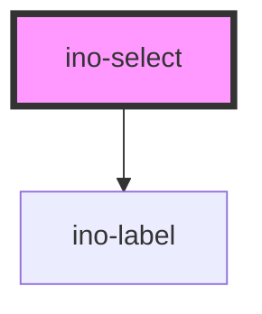

# ino-select

A component providing single-option select menus. It functions as a wrapper around the material design's [select](https://github.com/material-components/material-components-web/tree/master/packages/mdc-select) component.

### Usage

The component can be used as follows:

```js
document
  .querySelector('ino-select')
  .addEventListener('valueChange', (e) =>
    alert(`The new select value is: ${e.detail}`),
  );
```

```html
<ino-select
  autofocus
  disabled
  name="<string>"
  required
  value="<string>"
  ino-label="<string>"
  ino-outline
>
  <ino-option value="Option 1">Option 1</ino-option>
  <ino-option value="Option 2">Option 2</ino-option> ...
</ino-select>
```

### React

#### Example #1 - Basic

```js
import { Component } from 'react';
import { InoSelect, InoOption } from '@inovex.de/elements/dist/react';

class MyComponent extends Component {
  render() {
    return (
      <InoSelect; inoLabel="Form select"; required>
        <InoOption; value="Test">Test</InoOption>
      </InoSelect>;;
    )
  }
}
```

#### Example #2 - With Types

```js
import React, { Component } from 'react';
import { InoSelect, InoOption } from '@inovex.de/elements/dist/react';
import { Components } from '@inovex.de/elements/dist/types/components';

const Select: React.FunctionComponent<Components.InoSelectAttributes> = props => {
  const { inoLabel, required } = props;

  return (
    <InoSelect;
      inoLabel={inoLabel};
      required={required}
    >
      {props.children}
    </InoSelect>;;
  )
};

class MyComponent extends Component {
  render() {
    return (
      <Select; inoLabel="Form select"; required>
        <InoOption; value="Test">Test</InoOption>
      </Select>;;
    )
  }
}
```

## Additional Hints

Use the custom `ino-option` component to add options to the select component. The `ino-label` attribute sets an optional floating label for this element.

### Control flow

The select has a controlled (unmanaged) attribute `value`. For this reason, the value doesn't change on user interaction but on updates of `value`. Listen to `valueChange`, sync it with your local state and pass the new value to the component again to change value of select.

```js
document
  .querySelector('ino-select')
  .addEventListener('valueChange', (e) => (this.state.value = e.detail));
```

### Event Behaviour

The component behaves like a native select with additional features. The native `input'` is not bubbled. The component will emit a `valueChange` event if the value of the group changes.

<!-- Auto Generated Below -->


## Properties

| Property           | Attribute             | Description                                                                                                | Type      | Default     |
| ------------------ | --------------------- | ---------------------------------------------------------------------------------------------------------- | --------- | ----------- |
| `disabled`         | `disabled`            | Disables this element.                                                                                     | `boolean` | `undefined` |
| `inoLabel`         | `ino-label`           | The label of this element                                                                                  | `string`  | `undefined` |
| `inoOutline`       | `ino-outline`         | Styles this select box as outlined element.                                                                | `boolean` | `undefined` |
| `inoShowLabelHint` | `ino-show-label-hint` | If true, an *optional* message is displayed if not required, otherwise a * marker is displayed if required | `boolean` | `undefined` |
| `name`             | `name`                | The name of this element.                                                                                  | `string`  | `undefined` |
| `required`         | `required`            | Marks this element as required.                                                                            | `boolean` | `undefined` |
| `value`            | `value`               | The value of this element. (**unmanaged**)                                                                 | `string`  | `''`        |


## Events

| Event         | Description                                                           | Type                  |
| ------------- | --------------------------------------------------------------------- | --------------------- |
| `valueChange` | Emits when a selection changes. Contains new value in `event.detail`. | `CustomEvent<string>` |


## CSS Custom Properties

| Name              | Description                    |
| ----------------- | ------------------------------ |
| `--select-height` | Height of the open select menu |


## Dependencies

### Depends on

- [ino-label](../ino-label)

### Graph


----------------------------------------------

*Built with [StencilJS](https://stenciljs.com/)*
