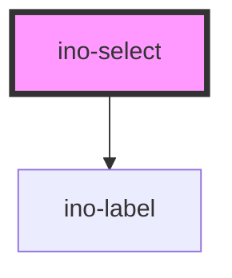

# ino-select

<!-- Auto Generated Below -->

## Overview

A component providing single-option select menus. It functions as a wrapper around the material design's [select](https://github.com/material-components/material-components-web/tree/master/packages/mdc-select) component.
#### Additional Hints
Use the custom `ino-option` component to add options to the select component. The `label` attribute sets an optional floating label for this element.

## Properties

| Property           | Attribute           | Description                                                                                                                                     | Type      | Default     |
| ------------------ | ------------------- | ----------------------------------------------------------------------------------------------------------------------------------------------- | --------- | ----------- |
| `disabled`         | `disabled`          | Disables this element.                                                                                                                          | `boolean` | `undefined` |
| `error`            | `error`             | Displays the select as invalid if set to true. If the property is not set or set to false, the validation is handled by the default validation. | `boolean` | `undefined` |
| `helper`           | `helper`            | A helper text to display below the select element. By default, non-validation helper text is always visible.                                    | `string`  | `undefined` |
| `helperPersistent` | `helper-persistent` | When the helper text is serving as a validation message, make it permanently visible regardless of the select's validity.                       | `boolean` | `undefined` |
| `helperValidation` | `helper-validation` | Indicates the helper text is a validation message. By default validation message is hidden unless the select is invalid.                        | `boolean` | `undefined` |
| `label`            | `label`             | The label of this element.                                                                                                                      | `string`  | `undefined` |
| `name`             | `name`              | The name of this element.                                                                                                                       | `string`  | `undefined` |
| `outline`          | `outline`           | Styles this select box as outlined element.                                                                                                     | `boolean` | `undefined` |
| `required`         | `required`          | Marks this element as required.                                                                                                                 | `boolean` | `undefined` |
| `showLabelHint`    | `show-label-hint`   | If true, an *optional* message is displayed if not required, otherwise a * marker is displayed if required.                                     | `boolean` | `undefined` |
| `value`            | `value`             | The value of this element. (**unmanaged**)                                                                                                      | `string`  | `''`        |

## Events

| Event         | Description                                                           | Type                  |
| ------------- | --------------------------------------------------------------------- | --------------------- |
| `valueChange` | Emits when a selection changes. Contains new value in `event.detail`. | `CustomEvent<string>` |

## Methods

### `setBlur() => Promise<void>`

Sets blur on the native `input`.
Use this method instead of the global `input.blur()`.

#### Returns

Type: `Promise<void>`

### `setFocus() => Promise<void>`

Sets focus on the native `input`.
Use this method instead of the global `input.focus()`.

#### Returns

Type: `Promise<void>`

## Slots

| Slot             | Description                       |
| ---------------- | --------------------------------- |
| `"default"`      | One or more `ino-option(-group)`* |
| `"icon-leading"` | For the icon to be prepended      |

## CSS Custom Properties

| Name                      | Description                           |
| ------------------------- | ------------------------------------- |
| `--ino-border-radius`     | Border-radius of the open select menu |
| `--ino-select-height`     | Height of the open select menu        |
| `--ino-select-icon-color` | Icon color                            |

## Dependencies

### Depends on

- [ino-label](../ino-label)

### Graph

----------------------------------------------

*Built with [StencilJS](https://stenciljs.com/)*
