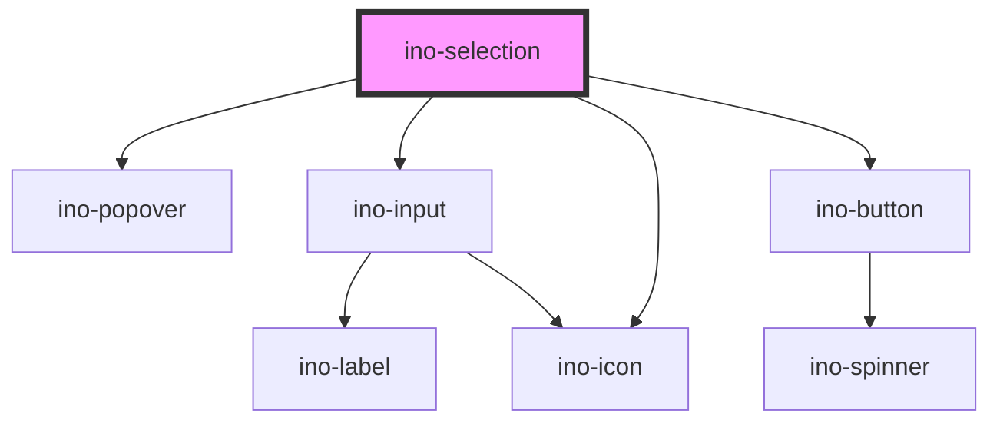

# ino-selection

<!-- Auto Generated Below -->

## Properties

| Property               | Attribute             | Description                                                                                                                                                                                              | Type                                                                                                                                                                                                         | Default                      |
| ---------------------- | --------------------- | -------------------------------------------------------------------------------------------------------------------------------------------------------------------------------------------------------- | ------------------------------------------------------------------------------------------------------------------------------------------------------------------------------------------------------------ | ---------------------------- |
| `controlled`           | `controlled`          | Used to indicate if the visibility of the ino-selection should be controlled by itself (`false`) or manually by the `visible` property (`true`) of the popover                                           | `boolean`                                                                                                                                                                                                    | `false`                      |
| `createOptionLabel`    | `create-option-label` | The label for creating a new option button                                                                                                                                                               | `string`                                                                                                                                                                                                     | `"Add option"`               |
| `debounce`             | `debounce`            | Number of ms the search function should be delayed after the user typed something.                                                                                                                       | `number`                                                                                                                                                                                                     | `100`                        |
| `disabled`             | `disabled`            | Disables this element.                                                                                                                                                                                   | `boolean`                                                                                                                                                                                                    | `undefined`                  |
| `displayAddOption`     | `display-add-option`  | Displays a "add new option item" button                                                                                                                                                                  | `boolean`                                                                                                                                                                                                    | `true`                       |
| `emptyInputMessage`    | `empty-input-message` | A message to show consumer how to add a new option. Shows up if `ino-input` is empty                                                                                                                     | `string`                                                                                                                                                                                                     | `"Type to add new option"`   |
| `error`                | `error`               | Displays the select as invalid if set to true. If the property is not set or set to false, the validation is handled by the default validation.                                                          | `boolean`                                                                                                                                                                                                    | `undefined`                  |
| `for`                  | `for`                 | The target id the popover belongs to. If not given, the popover is attached to the element provided in the named slot (`popover-trigger`) or the parent component if a slot element does not exist.      | `string`                                                                                                                                                                                                     | `undefined`                  |
| `label`                | `label`               | The placeholder text of the input.                                                                                                                                                                       | `string`                                                                                                                                                                                                     | `undefined`                  |
| `noOptionsText`        | `no-options-text`     | Text to display when there are no options found, where `$` is the placeholder for the input of the user.                                                                                                 | `string`                                                                                                                                                                                                     | `'Found No Results for "$"'` |
| `open`                 | `open`                | marks the state of the selection as open.  Initial value is `false`                                                                                                                                      | `boolean`                                                                                                                                                                                                    | `false`                      |
| `options` _(required)_ | --                    | All options either as string array or as array of `{key: string; value: string}` objects.                                                                                                                | `KeyValue[] \| string[]`                                                                                                                                                                                     | `undefined`                  |
| `placement`            | `placement`           | The placement of this popover. Accepted values: `top(-start, -end)`, `right(-start, -end)`, `bottom(-start, -end)`, `left(-start, -end)`                                                                 | `"auto" \| "auto-end" \| "auto-start" \| "bottom" \| "bottom-end" \| "bottom-start" \| "left" \| "left-end" \| "left-start" \| "right" \| "right-end" \| "right-start" \| "top" \| "top-end" \| "top-start"` | `'auto'`                     |
| `stayOpen`             | `stay-open`           | If true, keeps selection open, after selecting a option  default `stayOpen = false`                                                                                                                      | `boolean`                                                                                                                                                                                                    | `false`                      |
| `value`                | `value`               | The value of this element. (**unmanaged**)                                                                                                                                                               | `string \| { key: string; value: string; }`                                                                                                                                                                  | `undefined`                  |
| `visible`              | `visible`             | Programmatically show or hide ino-selection. Can only be used in controlled mode (see property `controlled`). Use the `selectionVisibleChanged` to sync the ino-selections' visibility state with yours. | `boolean`                                                                                                                                                                                                    | `false`                      |

## Events

| Event                     | Description                                                                                                                                                                                                                                                                                                                                                                 | Type                                                     |
| ------------------------- | --------------------------------------------------------------------------------------------------------------------------------------------------------------------------------------------------------------------------------------------------------------------------------------------------------------------------------------------------------------------------- | -------------------------------------------------------- |
| `optionCreated`           | Emits string of the added option. Contains new value in `event.detail`.                                                                                                                                                                                                                                                                                                     | `CustomEvent<string \| { key: string; value: string; }>` |
| `selectionVisibleChanged` | Emits when the ino-selection wants to show (`true`) or hide (`false`) itself. This is depended on the `trigger` property. Use this event in controlled-mode (see `controlled`).  e.g.: `trigger = 'click'` - This events emits with `true` when the user clicks on the target (slot/`for`/parent-element) and emits with `false` when the target or the outside is clicked. | `CustomEvent<boolean>`                                   |
| `valueChange`             | Emits the list item the user clicked on either as a string or a `{key: string; value: string}` object depending on the provided options.  Trigger on two occasions: 1. The user clicked on a list-item. 2. The user types in a string that matches an option and blurs the input                                                                                            | `CustomEvent<string \| { key: string; value: string; }>` |

## Slots

| Slot                | Description                                  |
| ------------------- | -------------------------------------------- |
| `"popover-trigger"` | The target element to attach the triggers to |

## Dependencies

### Depends on

- [ino-popover](../ino-popover)
- [ino-input](../ino-input)
- [ino-icon](../ino-icon)
- [ino-button](../ino-button)

### Graph

----------------------------------------------

*Built with [StencilJS](https://stenciljs.com/)*
