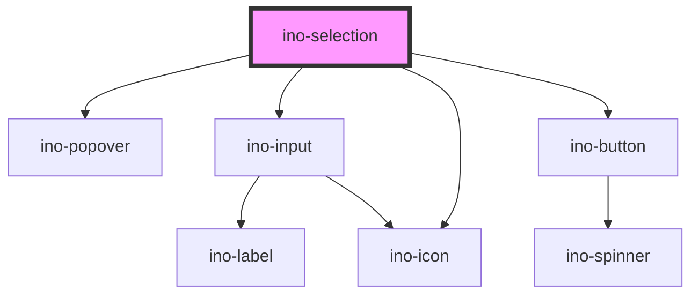

# ino-selection

A component providing a searchable and expandable selection menu inside a [<ino-popover>](https://elements.inovex.de/de/library/components?element=notification-ino-popover--playground).

This component handles the following tasks:

- Management of the `value` property of the [<ino-input>](https://elements.inovex.de/de/library/components?element=input-ino-input--playground) element
- Management of showing and hiding the different options filtered on the basis of the input
- Keyboard navigation on the options
- Renders content of `<ino-popover>` only on opening

### Usage

The component can be used as follows

```html
<ino-selection 
  id="<string>"
  debounce="<number>"
  no-options-text="<string>"
  placement="<string>"
  distance="<number>"
  for="<string>"
  label="<string>"
  stay-open="<boolean>"
  value="<string[] | {key: <string>, value: <string>}[]>"
  error="<string>"
  options="<string[] | {key: <string>, value: <string>}[]>"
  create-option-label="<string>"
  hide-create-option="<boolean>"
  controlled="<boolean>"
  visible="<boolean>"
  onValueChange="handleValueChange()"
  onOptionCreated="handleOptionCreated()"
  onSelectionVisibleChanged="handleSelectionVisibleChanged()"
>
  <ino-chip slot="popover-trigger" ...>open selection</ino-chip> // use clickable element of your choice ino-button, ino-chip ...
</ino-selection>
```

```js
document
  .querySelector('ino-selection');
  .addEventListener('valueChange', (e) => alert(`The new select value is: ${e.detail}`));

```

### React

#### Example #1 - Basic
<!-- Weird indentations because of render in Storybook -->
```jsx
import { Component } from 'react';
import { InoSelection, InoChip } from '@inovex.de/elements/dist/react';

class MyComponent extends Component {
  render() {
    return (
      <InoSelection 
                    id={id}
                    debounce={debounce}
                    noOptionsText={noOptionText}
                    placement={placement}
                    distance={number}
                    for={for}
                    label={label}
                    stayOpen
                    value={value}
                    error={error}
                    options={options}
                    createOptionLabel={createOptionLabel}
                    hideCreateOption
                    controlled
                    visible
                    onValueChange={handleValueChange}
                    onOptionCreated={handleOptionCreated}
                    onSelectionVisibleChanged={handleSelectionVisibleChanged}
            >
              <ino-chip slot="popover-trigger">open selection</ino-chip>
            </InoSelection>
    )
  }
}
```
#### Example #2 - With Types

```jsx
import React, { Component } from 'react';
import { InoSelection, InoChip } from '@inovex.de/elements/dist/react';
import { Components } from '@inovex.de/elements/dist/types/components';

const Selection: React.FunctionComponent<Components.InoSelectionAttributes> = props => {
  const { id, debounce, noOptionsText, placement, distance, for, label, stayOpen, value, error, options, createOptionLabel, hideCreateOption, controlled, visible, onValueChange, onOptionCreated, onSelectionVisibleChanged } = props;

  return (
    <InoSelection 
            id={id}
            debounce={debounce}
            noOptionsText={noOptionText}
            placement={placement}
            distance={number}
            for={for}
            label={label}
            stayOpen
            value={value}
            error={error}
            options={options}
            createOptionLabel={createOptionLabel}
            hideCreateOption
            controlled
            visible
            onValueChange={handleValueChange}
            onOptionCreated={handleOptionCreated}
            onSelectionVisibleChanged={handleSelectionVisibleChanged}
        >
          <ino-chip slot="popover-trigger">open selection</ino-chip>
        </InoSelection>
  )
};

class MyComponent extends Component {
  render() {
    return (
      <Selection
                id={id}
                debounce={debounce}
                noOptionsText={noOptionText}
                placement={placement}
                distance={number}
                for={for}
                label={label}
                stayOpen
                value={value}
                error={error}
                options={options}
                createOptionLabel={createOptionLabel}
                hideCreateOption
                controlled
                visible
                onValueChange={handleValueChange}
                onOptionCreated={handleOptionCreated}
                onSelectionVisibleChanged={handleSelectionVisibleChanged}
            >
              <ino-chip slot="popover-trigger">open selection</ino-chip>
            </Selection>
    )
  }
}
```
## Additional Hints

By clicking the `+`-button, the current search term will be emitted as `optionCreated` Event. To give the user an immediate overview of which option they will add, use the current search term of `input` in `addOptionLabel`. See visual example [Create Option Label](https://elements.inovex.de/de/library/components?element=input-ino-selection--create-option-label)

```js
document
  .querySelector('ino-selection')
  .addEventListener('selectionVisibleChanged', (e) => {
    // ino-input only renders on visible ino-selection
    if(this.state.visible) {
      document
        .querySelector('ino-input')
        .addEventListener('valueChange', (e) => {
          this.state.createOptionLabel = `Add Option "${e.detail}"`
          }
        );
    }
  })
```
 
### Control flow

The selection has a controlled (unmanaged) attribute `value`. For this reason, the value doesn't change on user interaction but on updates of `value`. Listen to `valueChange`, sync it with your local state and pass the new value to the component again to change value of selection.

```js
document
  .querySelector('ino-selection')
  .addEventListener('valueChange', (e) => (this.state.value = e.detail));
```

The option list can be extended in a similar behavior. Listen to `optionCreated` and add the received value to the `options` attribute.

```js
document
  .querySelector('ino-selection')
  .addEventListener('optionCreated', (e) => (this.state.options = [...this.state.options, e.detail]));
```


### Event Behavior

The component behaves like a native select with additional features. The native `input'` is not bubbled. The component will emit a `valueChange` event if the value of the group changes, a `optionCreated` event if a new option is created and a `selectionVisibleChanged` in controlled mode if `ino-selection` wants to open.


<!-- Auto Generated Below -->


## Properties

| Property               | Attribute             | Description                                                                                                                                                                                                                          | Type                                                                                                                                                                                                         | Default              |
| ---------------------- | --------------------- | ------------------------------------------------------------------------------------------------------------------------------------------------------------------------------------------------------------------------------------ | ------------------------------------------------------------------------------------------------------------------------------------------------------------------------------------------------------------ | -------------------- |
| `controlled`           | `controlled`          | Used to indicate if the visibility of the ino-selection should be controlled by itself (`false`) or manually by the `visible` property (`true`) of the popover                                                                       | `boolean`                                                                                                                                                                                                    | `false`              |
| `createOptionLabel`    | `create-option-label` | The label for creating a new option button                                                                                                                                                                                           | `string`                                                                                                                                                                                                     | `'Add option'`       |
| `debounce`             | `debounce`            | Number of ms the search function should be delayed after the user typed something.                                                                                                                                                   | `number`                                                                                                                                                                                                     | `100`                |
| `distance`             | `distance`            | Displaces the ino-selection away from, or toward, the anchor element in the direction of its placement. A positive number displaces it further away, while a negative number lets it overlap the anchor.                             | `number`                                                                                                                                                                                                     | `14`                 |
| `error`                | `error`               | Displays the select as invalid if set to true. If the property is not set or set to false, the validation is handled by the default validation.                                                                                      | `boolean`                                                                                                                                                                                                    | `undefined`          |
| `for`                  | `for`                 | The target id the popover belongs to. If not given, the popover is attached to the element provided in the named slot (`popover-trigger`) or the parent component if a slot element does not exist.                                  | `string`                                                                                                                                                                                                     | `undefined`          |
| `hideCreateOption`     | `hide-create-option`  | Hides the footer with the "add new Option" button                                                                                                                                                                                    | `boolean`                                                                                                                                                                                                    | `false`              |
| `label`                | `label`               | The placeholder text of the input.                                                                                                                                                                                                   | `string`                                                                                                                                                                                                     | `undefined`          |
| `noOptionsText`        | `no-options-text`     | Text to display when there are no options found, where `$` is the placeholder for the input of the user.                                                                                                                             | `string`                                                                                                                                                                                                     | `'Found No Results'` |
| `options` _(required)_ | --                    | All options either as string array or as array of `{key: string; value: string}` objects.                                                                                                                                            | `KeyValue[] \| string[]`                                                                                                                                                                                     | `undefined`          |
| `placement`            | `placement`           | The placement of this popover. Accepted values: `top(-start, -end)`, `right(-start, -end)`, `bottom(-start, -end)`, `left(-start, -end)`                                                                                             | `"auto" \| "auto-end" \| "auto-start" \| "bottom" \| "bottom-end" \| "bottom-start" \| "left" \| "left-end" \| "left-start" \| "right" \| "right-end" \| "right-start" \| "top" \| "top-end" \| "top-start"` | `'auto'`             |
| `stayOpen`             | `stay-open`           | If true, keeps selection open, after selecting a option  default `stayOpen = false`                                                                                                                                                  | `boolean`                                                                                                                                                                                                    | `false`              |
| `value`                | --                    | List of selected items. (**unmanaged**)                                                                                                                                                                                              | `KeyValue[] \| string[]`                                                                                                                                                                                     | `undefined`          |
| `visible`              | `visible`             | Shows visibility of ino-selection.   Use with controlled mode (see property `controlled`) to programmatically show or hide ino-selection- Use the `selectionVisibleChanged` to sync the ino-selections' visibility state with yours. | `boolean`                                                                                                                                                                                                    | `false`              |


## Events

| Event                     | Description                                                                                                                                                                                                                                                                                                                                                                 | Type                                                     |
| ------------------------- | --------------------------------------------------------------------------------------------------------------------------------------------------------------------------------------------------------------------------------------------------------------------------------------------------------------------------------------------------------------------------- | -------------------------------------------------------- |
| `optionCreated`           | Emits string of the added option. Contains new value in `event.detail`.                                                                                                                                                                                                                                                                                                     | `CustomEvent<string \| { key: string; value: string; }>` |
| `selectionVisibleChanged` | Emits when the ino-selection wants to show (`true`) or hide (`false`) itself. This is depended on the `trigger` property. Use this event in controlled-mode (see `controlled`).  e.g.: `trigger = 'click'` - This events emits with `true` when the user clicks on the target (slot/`for`/parent-element) and emits with `false` when the target or the outside is clicked. | `CustomEvent<boolean>`                                   |
| `valueChange`             | Emits the list item the user clicked on either as a string or a `{key: string; value: string}` object depending on the provided options.                                                                                                                                                                                                                                    | `CustomEvent<string \| { key: string; value: string; }>` |


## Slots

| Slot                | Description                                  |
| ------------------- | -------------------------------------------- |
| `"popover-trigger"` | The target element to attach the triggers to |


## Dependencies

### Depends on

- [ino-popover](../ino-popover)
- [ino-input](../ino-input)
- [ino-icon](../ino-icon)
- [ino-button](../ino-button)

### Graph


----------------------------------------------

*Built with [StencilJS](https://stenciljs.com/)*
