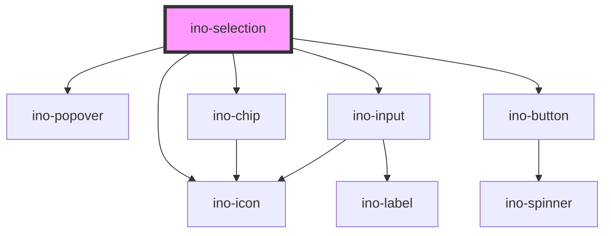

# ino-selection

<!-- Auto Generated Below -->

## Properties

| Property           | Attribute            | Description                                                                                                                                                                                         | Type                                                                                                                                                                                                         | Default                                                                                                                                                                                                                                                                                                                                                                                                                                                                                                                                                                                                                                                                                                                                                                                                                                                                                                                                                                                                                                                                                                                                                                                                                                                                                                                                                                                                                                                                                                                                                                                                                                                                                                                                                                                                                                                                                                                                                                                                                                                                                                                                                                                                                                                                                                                                                                                                                                                                                                                |
| ------------------ | -------------------- | --------------------------------------------------------------------------------------------------------------------------------------------------------------------------------------------------- | ------------------------------------------------------------------------------------------------------------------------------------------------------------------------------------------------------------ | ---------------------------------------------------------------------------------------------------------------------------------------------------------------------------------------------------------------------------------------------------------------------------------------------------------------------------------------------------------------------------------------------------------------------------------------------------------------------------------------------------------------------------------------------------------------------------------------------------------------------------------------------------------------------------------------------------------------------------------------------------------------------------------------------------------------------------------------------------------------------------------------------------------------------------------------------------------------------------------------------------------------------------------------------------------------------------------------------------------------------------------------------------------------------------------------------------------------------------------------------------------------------------------------------------------------------------------------------------------------------------------------------------------------------------------------------------------------------------------------------------------------------------------------------------------------------------------------------------------------------------------------------------------------------------------------------------------------------------------------------------------------------------------------------------------------------------------------------------------------------------------------------------------------------------------------------------------------------------------------------------------------------------------------------------------------------------------------------------------------------------------------------------------------------------------------------------------------------------------------------------------------------------------------------------------------------------------------------------------------------------------------------------------------------------------------------------------------------------------------------------------------------- |
| `debounce`         | `debounce`           | Number of ms the search function should be delayed after the user typed something.                                                                                                                  | `number`                                                                                                                                                                                                     | `100`                                                                                                                                                                                                                                                                                                                                                                                                                                                                                                                                                                                                                                                                                                                                                                                                                                                                                                                                                                                                                                                                                                                                                                                                                                                                                                                                                                                                                                                                                                                                                                                                                                                                                                                                                                                                                                                                                                                                                                                                                                                                                                                                                                                                                                                                                                                                                                                                                                                                                                                  |
| `disabled`         | `disabled`           | Disables this element.                                                                                                                                                                              | `boolean`                                                                                                                                                                                                    | `undefined`                                                                                                                                                                                                                                                                                                                                                                                                                                                                                                                                                                                                                                                                                                                                                                                                                                                                                                                                                                                                                                                                                                                                                                                                                                                                                                                                                                                                                                                                                                                                                                                                                                                                                                                                                                                                                                                                                                                                                                                                                                                                                                                                                                                                                                                                                                                                                                                                                                                                                                            |
| `displayAddOption` | `display-add-option` | Displays a add new option item button                                                                                                                                                               | `boolean`                                                                                                                                                                                                    | `true`                                                                                                                                                                                                                                                                                                                                                                                                                                                                                                                                                                                                                                                                                                                                                                                                                                                                                                                                                                                                                                                                                                                                                                                                                                                                                                                                                                                                                                                                                                                                                                                                                                                                                                                                                                                                                                                                                                                                                                                                                                                                                                                                                                                                                                                                                                                                                                                                                                                                                                                 |
| `error`            | `error`              | Displays the select as invalid if set to true. If the property is not set or set to false, the validation is handled by the default validation.                                                     | `boolean`                                                                                                                                                                                                    | `undefined`                                                                                                                                                                                                                                                                                                                                                                                                                                                                                                                                                                                                                                                                                                                                                                                                                                                                                                                                                                                                                                                                                                                                                                                                                                                                                                                                                                                                                                                                                                                                                                                                                                                                                                                                                                                                                                                                                                                                                                                                                                                                                                                                                                                                                                                                                                                                                                                                                                                                                                            |
| `for`              | `for`                | The target id the popover belongs to. If not given, the popover is attached to the element provided in the named slot (`popover-trigger`) or the parent component if a slot element does not exist. | `string`                                                                                                                                                                                                     | `undefined`                                                                                                                                                                                                                                                                                                                                                                                                                                                                                                                                                                                                                                                                                                                                                                                                                                                                                                                                                                                                                                                                                                                                                                                                                                                                                                                                                                                                                                                                                                                                                                                                                                                                                                                                                                                                                                                                                                                                                                                                                                                                                                                                                                                                                                                                                                                                                                                                                                                                                                            |
| `label`            | `label`              | The label of this element.                                                                                                                                                                          | `string`                                                                                                                                                                                                     | `undefined`                                                                                                                                                                                                                                                                                                                                                                                                                                                                                                                                                                                                                                                                                                                                                                                                                                                                                                                                                                                                                                                                                                                                                                                                                                                                                                                                                                                                                                                                                                                                                                                                                                                                                                                                                                                                                                                                                                                                                                                                                                                                                                                                                                                                                                                                                                                                                                                                                                                                                                            |
| `noOptionsText`    | `no-options-text`    | Text to display when there are no options found, where `$` is the placeholder for the input of the user.                                                                                            | `string`                                                                                                                                                                                                     | `'Found No Results for "$"'`                                                                                                                                                                                                                                                                                                                                                                                                                                                                                                                                                                                                                                                                                                                                                                                                                                                                                                                                                                                                                                                                                                                                                                                                                                                                                                                                                                                                                                                                                                                                                                                                                                                                                                                                                                                                                                                                                                                                                                                                                                                                                                                                                                                                                                                                                                                                                                                                                                                                                           |
| `open`             | `open`               | marks the state of the selection as open.  Initial value is `false`                                                                                                                                 | `boolean`                                                                                                                                                                                                    | `false`                                                                                                                                                                                                                                                                                                                                                                                                                                                                                                                                                                                                                                                                                                                                                                                                                                                                                                                                                                                                                                                                                                                                                                                                                                                                                                                                                                                                                                                                                                                                                                                                                                                                                                                                                                                                                                                                                                                                                                                                                                                                                                                                                                                                                                                                                                                                                                                                                                                                                                                |
| `options`          | --                   | All options either as a string array or as an array of `{key: string; value: string}` objects.                                                                                                      | `KeyValue[] \| string[]`                                                                                                                                                                                     | `['G19rtWZ', 'hS4H39n', 'ExjSww5', 'd4TCQRi', 'o3TzSar', '236kaJV', 'sa6b1eN', 'z0lIC65', 'kYK8f9W', 'iudHeJO', 'MZwVQcY', 'vycnbCg', 'xtcTPee', '6ap8Drh', '5357cWY', 'gECnm4K', 'EoxR3p0', 'lWDWdb0', '5d0k2EY', 'jrnu5pJ', 'G19rtWZ', 'hS4H39n', 'ExjSww5', 'd4TCQRi', 'o3TzSar', '236kaJV', 'sa6b1eN', 'z0lIC65', 'kYK8f9W', 'iudHeJO', 'MZwVQcY', 'vycnbCg', 'xtcTPee', '6ap8Drh', '5357cWY', 'gECnm4K', 'EoxR3p0', 'lWDWdb0', '5d0k2EY', 'jrnu5pJ', 'G19rtWZ', 'hS4H39n', 'ExjSww5', 'd4TCQRi', 'o3TzSar', '236kaJV', 'sa6b1eN', 'z0lIC65', 'kYK8f9W', 'iudHeJO', 'MZwVQcY', 'vycnbCg', 'xtcTPee', '6ap8Drh', '5357cWY', 'gECnm4K', 'EoxR3p0', 'lWDWdb0', '5d0k2EY', 'jrnu5pJ', 'G19rtWZ', 'hS4H39n', 'ExjSww5', 'd4TCQRi', 'o3TzSar', '236kaJV', 'sa6b1eN', 'z0lIC65', 'kYK8f9W', 'iudHeJO', 'MZwVQcY', 'vycnbCg', 'xtcTPee', '6ap8Drh', '5357cWY', 'gECnm4K', 'EoxR3p0', 'lWDWdb0', '5d0k2EY', 'jrnu5pJ', 'G19rtWZ', 'hS4H39n', 'ExjSww5', 'd4TCQRi', 'o3TzSar', '236kaJV', 'sa6b1eN', 'z0lIC65', 'kYK8f9W', 'iudHeJO', 'MZwVQcY', 'vycnbCg', 'xtcTPee', '6ap8Drh', '5357cWY', 'gECnm4K', 'EoxR3p0', 'lWDWdb0', '5d0k2EY', 'jrnu5pJ', 'G19rtWZ', 'hS4H39n', 'ExjSww5', 'd4TCQRi', 'o3TzSar', '236kaJV', 'sa6b1eN', 'z0lIC65', 'kYK8f9W', 'iudHeJO', 'MZwVQcY', 'vycnbCg', 'xtcTPee', '6ap8Drh', '5357cWY', 'gECnm4K', 'EoxR3p0', 'lWDWdb0', '5d0k2EY', 'jrnu5pJ', 'G19rtWZ', 'hS4H39n', 'ExjSww5', 'd4TCQRi', 'o3TzSar', '236kaJV', 'sa6b1eN', 'z0lIC65', 'kYK8f9W', 'iudHeJO', 'MZwVQcY', 'vycnbCg', 'xtcTPee', '6ap8Drh', '5357cWY', 'gECnm4K', 'EoxR3p0', 'lWDWdb0', '5d0k2EY', 'jrnu5pJ', 'G19rtWZ', 'hS4H39n', 'ExjSww5', 'd4TCQRi', 'o3TzSar', '236kaJV', 'sa6b1eN', 'z0lIC65', 'kYK8f9W', 'iudHeJO', 'MZwVQcY', 'vycnbCg', 'xtcTPee', '6ap8Drh', '5357cWY', 'gECnm4K', 'EoxR3p0', 'lWDWdb0', '5d0k2EY', 'jrnu5pJ', 'G19rtWZ', 'hS4H39n', 'ExjSww5', 'd4TCQRi', 'o3TzSar', '236kaJV', 'sa6b1eN', 'z0lIC65', 'kYK8f9W', 'iudHeJO', 'MZwVQcY', 'vycnbCg', 'xtcTPee', '6ap8Drh', '5357cWY', 'gECnm4K', 'EoxR3p0', 'lWDWdb0', '5d0k2EY', 'jrnu5pJ', 'G19rtWZ', 'hS4H39n', 'ExjSww5', 'd4TCQRi', 'o3TzSar', '236kaJV', 'sa6b1eN', 'z0lIC65', 'kYK8f9W', 'iudHeJO', 'MZwVQcY', 'vycnbCg', 'xtcTPee', '6ap8Drh', '5357cWY', 'gECnm4K', 'EoxR3p0', 'lWDWdb0', '5d0k2EY', 'jrnu5pJ', 'G19rtWZ', 'hS4H39n', 'ExjSww5', 'd4TCQRi', 'o3TzSar', '236kaJV', 'sa6b1eN', 'z0lIC65', 'kYK8f9W', 'iudHeJO', 'MZwVQcY', 'vycnbCg', 'xtcTPee', '6ap8Drh', '5357cWY', 'gECnm4K', 'EoxR3p0', 'lWDWdb0', '5d0k2EY', 'jrnu5pJ']` |
| `placement`        | `placement`          | The placement of this popover. Accepted values: `top(-start, -end)`, `right(-start, -end)`, `bottom(-start, -end)`, `left(-start, -end)`                                                            | `"auto" \| "auto-end" \| "auto-start" \| "bottom" \| "bottom-end" \| "bottom-start" \| "left" \| "left-end" \| "left-start" \| "right" \| "right-end" \| "right-start" \| "top" \| "top-end" \| "top-start"` | `'auto'`                                                                                                                                                                                                                                                                                                                                                                                                                                                                                                                                                                                                                                                                                                                                                                                                                                                                                                                                                                                                                                                                                                                                                                                                                                                                                                                                                                                                                                                                                                                                                                                                                                                                                                                                                                                                                                                                                                                                                                                                                                                                                                                                                                                                                                                                                                                                                                                                                                                                                                               |
| `stayOpen`         | `stay-open`          | The selection stays open, after selecting a option  default `stayOpen = false`                                                                                                                      | `boolean`                                                                                                                                                                                                    | `false`                                                                                                                                                                                                                                                                                                                                                                                                                                                                                                                                                                                                                                                                                                                                                                                                                                                                                                                                                                                                                                                                                                                                                                                                                                                                                                                                                                                                                                                                                                                                                                                                                                                                                                                                                                                                                                                                                                                                                                                                                                                                                                                                                                                                                                                                                                                                                                                                                                                                                                                |
| `value`            | `value`              | The value of this element. (**unmanaged**)                                                                                                                                                          | `string \| { key: string; value: string; }`                                                                                                                                                                  | `undefined`                                                                                                                                                                                                                                                                                                                                                                                                                                                                                                                                                                                                                                                                                                                                                                                                                                                                                                                                                                                                                                                                                                                                                                                                                                                                                                                                                                                                                                                                                                                                                                                                                                                                                                                                                                                                                                                                                                                                                                                                                                                                                                                                                                                                                                                                                                                                                                                                                                                                                                            |

## Events

| Event         | Description                                                                                                                                                                                                                                                                      | Type                                                     |
| ------------- | -------------------------------------------------------------------------------------------------------------------------------------------------------------------------------------------------------------------------------------------------------------------------------- | -------------------------------------------------------- |
| `optionAdded` | Emits when the string of the added option. Contains new value in `event.detail`.                                                                                                                                                                                                 | `CustomEvent<string>`                                    |
| `valueChange` | Emits the list item the user clicked on either as a string or a `{key: string; value: string}` object depending on the provided options.  Trigger on two occasions: 1. The user clicked on a list-item. 2. The user types in a string that matches an option and blurs the input | `CustomEvent<string \| { key: string; value: string; }>` |

## Slots

| Slot                | Description                                  |
| ------------------- | -------------------------------------------- |
| `"popover-trigger"` | The target element to attach the triggers to |

## Dependencies

### Depends on

- [ino-popover](../ino-popover)
- [ino-chip](../ino-chip)
- [ino-input](../ino-input)
- [ino-button](../ino-button)
- [ino-icon](../ino-icon)

### Graph

----------------------------------------------

*Built with [StencilJS](https://stenciljs.com/)*
