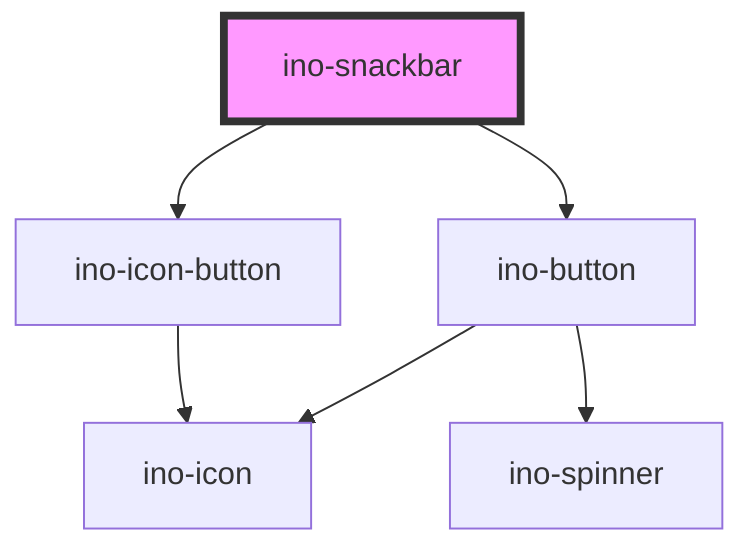

# ino-snackbar

Snackbars provide brief messages about app processes at the bottom of the screen. It functions as a wrapper around the material design's [Snackbar](https://github.com/material-components/material-components-web/tree/master/packages/mdc-snackbar) component

### Usage

The component can be used as follows:

```js
document
  .querySelector('ino-snackbar')
  .addEventListener('inoActionClick', e => alert('Action-Button was clicked!'));

document
  .querySelector('ino-snackbar')
  .addEventListener('hideEl', e => alert('Snackbar hides!'));
```

```html
<ino-snackbar
  ino-message="<string>"
  ino-action-text="<string>"
  ino-action-on-bottom
  ino-align-start
  oninoactionclick="handleClickEl()"
  onhideel="handleHideEl()"
>
</ino-snackbar>
```

### React

#### Example #1 - Basic

```js
import { Component } from 'react';
import { InoSnackbar } from '@inovex/elements/dist/react';

class MyComponent extends Component {
  render() {
    return (
      <InoSnackbar
        inoMessage="Message deleted"
        inoActionText="Undo"
        inoActionOnBottom={false}
        inoAlignStart={false}
      />
    );
  }
}
```

#### Example #2 - With Types

```js
import React, { Component } from 'react';
import { InoSnackbar } from '@inovex/elements/dist/react';
import { Components } from '@inovex/elements/dist/types/components';

const Snackbar: React.FunctionComponent<Components.InoSnackbarAttributes> = props => {
  const {
    inoMessage,
    inoActionText,
    inoActionOnBottom,
    inoAlignStart
  } = props;

  return (
    <InoSnackbar
      inoMessage={inoMessage}
      inoActionText={inoActionText}
      inoActionOnBottom={inoActionOnBottom}
      inoAlignStart={inoAlignStart}
    >
      {props.children}
    </InoSnackbar>
  );
};

class MyComponent extends Component {
  const conditionToRender = true;

  render() {
    return conditionToRender && (
      <Snackbar
        inoMessage="Message deleted"
        inoActionText="Undo"
        inoActionOnBottom={false}
        inoAlignStart={false}
      />
    );
  }
}
```

## Additional Hints

Snackbar is displayed when ino-show is changed to checked.

<!-- Auto Generated Below -->


## Properties

| Property        | Attribute         | Description                                                                                                                    | Type                            | Default     |
| --------------- | ----------------- | ------------------------------------------------------------------------------------------------------------------------------ | ------------------------------- | ----------- |
| `inoActionText` | `ino-action-text` | The text to display for the action button. If no text is defined, the snack bar is displayed in an alternative feedback style. | `string`                        | `''`        |
| `inoAlignment`  | `ino-alignment`   | Controls if Snackbar is centered or left-aligned or right-aligned.                                                             | `"center" \| "left" \| "right"` | `'center'`  |
| `inoMessage`    | `ino-message`     | The text message to display.                                                                                                   | `string`                        | `undefined` |


## Events

| Event            | Description                                                                                           | Type               |
| ---------------- | ----------------------------------------------------------------------------------------------------- | ------------------ |
| `hideEl`         | Event that emits as soon as the snackbar hides. Listen to this event to hide or destroy this element. | `CustomEvent<any>` |
| `inoActionClick` | Event that emits as soon as the action button is clicked.                                             | `CustomEvent<any>` |


## CSS Custom Properties

| Name                                        | Description                                      |
| ------------------------------------------- | ------------------------------------------------ |
| `--ino-snackbar-background-color`           | Background color                                 |
| `--ino-snackbar-color`                      | Text color                                       |
| `--ino-snackbar-icon-color`                 | Icon color                                       |
| `--ino-snackbar-no-action-background-color` | Background color of the snackbar without actions |
| `--ino-snackbar-no-action-color`            | Text color of the snackbar without actions       |
| `--ino-snackbar-no-action-icon-color`       | Icon color of the snackbar without actions       |


## Dependencies

### Depends on

- [ino-icon-button](../ino-icon-button)
- [ino-button](../ino-button)

### Graph


----------------------------------------------

*Built with [StencilJS](https://stenciljs.com/)*
