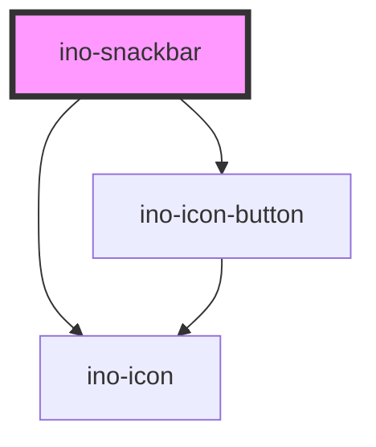

# ino-snackbar

<!-- Auto Generated Below -->

## Overview

Snackbars provide brief messages about app processes at the bottom of the screen. It functions as a wrapper around the material design's [Snackbar](https://github.com/material-components/material-components-web/tree/master/packages/mdc-snackbar) component.

## Properties

| Property             | Attribute               | Description                                                                                                                             | Type                                                          | Default                                                                     |
| -------------------- | ----------------------- | --------------------------------------------------------------------------------------------------------------------------------------- | ------------------------------------------------------------- | --------------------------------------------------------------------------- |
| `a11yLabels`         | --                      | The aria-labels used to provide accessible snackbar context as well as close icon button label.                                         | `{ snackbarLabel: string; closeLabel: string; }` | `{     snackbarLabel: this.type,     closeLabel: 'Close notification',   }` |
| `actionText`         | `action-text`           | The text to display for the action button. If no text is defined, the snack bar is displayed in an alternative feedback style.          | `string`                                                      | `undefined`                                                                 |
| `message`            | `message`               | **[DEPRECATED]**   [DEPRECATED] Please use the default slot instead The text message to display. | `string`                                                      | `undefined`                                                                 |
| `stayVisibleOnHover` | `stay-visible-on-hover` | If set to true, the timeout that closes the snackbar is paused when the user hovers over the snackbar.                                  | `boolean`                                                     | `false`                                                                     |
| `timeout`            | `timeout`               | Sets the timeout in ms until the snackbar disappears. The timeout can be disabled by setting it to a negative value.                    | `number`                                                      | `5000`                                                                      |
| `type`               | `type`                  | Changes the snackbar type. There are four types of messages: info, success, warning and error.                                          | `"error" \| "info" \| "success" \| "warning"`                 | `'info'`                                                                    |

## Events

| Event         | Description                                                                                           | Type               |
| ------------- | ----------------------------------------------------------------------------------------------------- | ------------------ |
| `actionClick` | Event that emits as soon as the action button is clicked.                                             | `CustomEvent<any>` |
| `hideEl`      | Event that emits as soon as the snackbar hides. Listen to this event to hide or destroy this element. | `CustomEvent<any>` |

## Slots

| Slot          | Description                                                                                   |
| ------------- | --------------------------------------------------------------------------------------------- |
| `"icon-slot"` | Use this slot to add a custom icon (e.g., `<ino-icon>` or ``) inside the `ino-snackbar`. |

## CSS Custom Properties

| Name                    | Description                 |
| ----------------------- | --------------------------- |
| `--ino-snackbar-bottom` | Distance to the bottom edge |
| `--ino-snackbar-left`   | Distance to the left edge   |
| `--ino-snackbar-right`  | Distance to the right edge  |
| `--ino-snackbar-top`    | Distance to the top edge    |

## Dependencies

### Depends on

- [ino-icon](../ino-icon)
- [ino-icon-button](../ino-icon-button)

### Graph

----------------------------------------------

*Built with [StencilJS](https://stenciljs.com/)*
