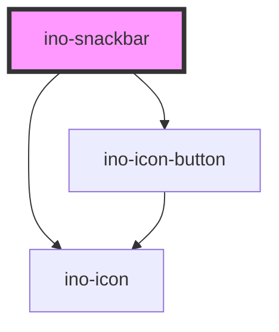

# ino-snackbar

Snackbars provide brief messages about app processes. It functions as a wrapper around the material design's [Snackbar](https://github.com/material-components/material-components-web/tree/master/packages/mdc-snackbar) component.

### Usage

The component can be used as follows:

```js
document
  .querySelector('ino-snackbar')
  .addEventListener('inoActionClick', (e) =>
    alert('Action-Button was clicked!'),
  );

document
  .querySelector('ino-snackbar')
  .addEventListener('hideEl', (e) => alert('Snackbar hides!'));
```

```html
<ino-snackbar
  message="<string>"
  action-text="<string>"
  horizontal-alignment="<string>"
  vertical-alignment="<string>"
  oninoactionclick="handleClickEl()"
  onhideel="handleHideEl()"
>
</ino-snackbar>
```

### React

#### Example #1 - Basic

```js
import { Component } from 'react';
import { InoSnackbar } from '@inovex.de/elements/dist/react';

class MyComponent extends Component {
  render() {
    return (
      <InoSnackbar
        inoMessage="Message deleted"
        inoActionText="Undo"
      />
    );
  }
}
```

#### Example #2 - With Types

```js
import React, { Component } from 'react';
import { InoSnackbar } from '@inovex.de/elements/dist/react';
import { Components } from '@inovex.de/elements/dist/types/components';

const Snackbar: React.FunctionComponent<Components.InoSnackbarAttributes> = props => {
  const {
    inoMessage,
    inoActionText,
  } = props;

  return (
    <InoSnackbar
      inoMessage={inoMessage}
      inoActionText={inoActionText}
    >
      {props.children}
    </InoSnackbar>
  );
};

class MyComponent extends Component {
  const conditionToRender = true;

  render() {
    return conditionToRender && (
      <Snackbar
        inoMessage="Message deleted"
        inoActionText="Undo"
      />
    );
  }
}
```

<!-- Auto Generated Below -->


## Properties

| Property             | Attribute               | Description                                                                                                                    | Type                             | Default     |
| -------------------- | ----------------------- | ------------------------------------------------------------------------------------------------------------------------------ | -------------------------------- | ----------- |
| `actionText`         | `action-text`           | The text to display for the action button. If no text is defined, the snack bar is displayed in an alternative feedback style. | `string`                         | `undefined` |
| `message`            | `message`               | The text message to display.                                                                                                   | `string`                         | `undefined` |
| `stayVisibleOnHover` | `stay-visible-on-hover` | If set to true, the timeout that closes the snackbar is paused when the user hovers over the snackbar.                         | `boolean`                        | `false`     |
| `timeout`            | `timeout`               | Sets the timeout in ms until the snackbar disappears. The timeout can be disabled by setting it to a negative value.           | `number`                         | `5000`      |
| `type`               | `type`                  | Changes the snackbar type                                                                                                      | `"error" \| "info" \| "success"` | `'info'`    |


## Events

| Event         | Description                                                                                           | Type               |
| ------------- | ----------------------------------------------------------------------------------------------------- | ------------------ |
| `actionClick` | Event that emits as soon as the action button is clicked.                                             | `CustomEvent<any>` |
| `hideEl`      | Event that emits as soon as the snackbar hides. Listen to this event to hide or destroy this element. | `CustomEvent<any>` |


## CSS Custom Properties

| Name                    | Description               |
| ----------------------- | ------------------------- |
| `--ino-snackbar-bottom` | size of the entire button |
| `--ino-snackbar-left`   | size of the entire button |
| `--ino-snackbar-right`  | size of the entire button |
| `--ino-snackbar-top`    | size of the entire button |


## Dependencies

### Depends on

- [ino-icon](../ino-icon)
- [ino-icon-button](../ino-icon-button)

### Graph


----------------------------------------------

*Built with [StencilJS](https://stenciljs.com/)*
