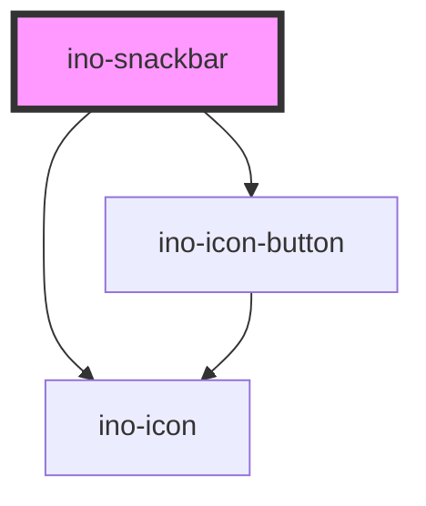

# ino-snackbar

<!-- Auto Generated Below -->

## Overview

Snackbars provide brief messages about app processes at the bottom of the screen. It functions as a wrapper around the material design's [Snackbar](https://github.com/material-components/material-components-web/tree/master/packages/mdc-snackbar) component

#### Usage Notes:

The `ino-snackbar` component can display an icon inside it, which can be customized as follows:

- **Default Icon Behavior**: If no element is provided in the `icon-slot`, the component displays a default icon based on the `type` property. Each `type` corresponds to a specific `ino-icon`.
- **Custom Icon (`<ino-icon>`)**: You can provide a custom `ino-icon` in the `icon-slot` to replace the default icon. Simply add `<ino-icon>` with your desired icon name to the `icon-slot`.
- **Other Custom Elements (e.g., ``)**: If you want to use a different element like an `` as the icon, place it inside the `icon-slot`. This will override the default `ino-icon`. For example, ``.

## Properties

| Property             | Attribute               | Description                                                                                                                             | Type                             | Default     |
| -------------------- | ----------------------- | --------------------------------------------------------------------------------------------------------------------------------------- | -------------------------------- | ----------- |
| `actionText`         | `action-text`           | The text to display for the action button. If no text is defined, the snack bar is displayed in an alternative feedback style.          | `string`                         | `undefined` |
| `message`            | `message`               | **[DEPRECATED]**   [DEPRECATED] Please use the default slot instead The text message to display. | `string`                         | `undefined` |
| `stayVisibleOnHover` | `stay-visible-on-hover` | If set to true, the timeout that closes the snackbar is paused when the user hovers over the snackbar.                                  | `boolean`                        | `false`     |
| `timeout`            | `timeout`               | Sets the timeout in ms until the snackbar disappears. The timeout can be disabled by setting it to a negative value.                    | `number`                         | `5000`      |
| `type`               | `type`                  | Changes the snackbar type. There are three types of messages: info, success, and error.                                                 | `"error" \| "info" \| "success"` | `'info'`    |

## Events

| Event         | Description                                                                                           | Type               |
| ------------- | ----------------------------------------------------------------------------------------------------- | ------------------ |
| `actionClick` | Event that emits as soon as the action button is clicked.                                             | `CustomEvent<any>` |
| `hideEl`      | Event that emits as soon as the snackbar hides. Listen to this event to hide or destroy this element. | `CustomEvent<any>` |

## Slots

| Slot          | Description                                                                                   |
| ------------- | --------------------------------------------------------------------------------------------- |
| `"icon-slot"` | Use this slot to add a custom icon (e.g., `<ino-icon>` or ``) inside the `ino-snackbar`. |

## Dependencies

### Depends on

- [ino-icon](../ino-icon)
- [ino-icon-button](../ino-icon-button)

### Graph

----------------------------------------------

*Built with [StencilJS](https://stenciljs.com/)*
