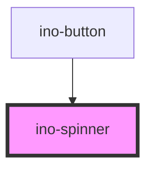

# ino-spinner

A component which displays a variety of spinners. Use spinners to show that the app is loading content or performing another process for which the user has to wait.

This component contains three different types of spinners animated with pure CSS. It mainly relies on [Spinkit](http://tobiasahlin.com/spinkit/) and may be extended in future with more types.

### Usage

The component can be used as follows:

```html
<ino-spinner
  ino-type="<string>"
  ino-color-scheme="<string>"
  ino-height="<number>"
  ino-modal
  ino-width="<number>"
>
</ino-spinner>
```

### React

#### Example #1 - Basic

```js
import { Component } from 'react';
import { InoSpinner } from '@inovex/elements/dist/react';

class MyComponent extends Component {
  render() {
    return <InoSpinner inoColorScheme="warning" />;
  }
}
```

#### Example #2 - With Types

```js
import React, { Component } from 'react';
import { InoSpinner } from '@inovex/elements/dist/react';
import { Components } from '@inovex/elements/dist/types/components';

const Spinner: React.FunctionComponent<Components.InoSpinnerAttributes> = props => {
  const { inoColorScheme } = props;

  return (
    <InoSpinner inoColorScheme={inoColorScheme}>{props.children}</InoSpinner>
  );
};

class MyComponent extends Component {
  render() {
    return <Spinner inoColorScheme="warning" />;
  }
}
```

## Additional Hints

Use one of the provided types in `ino-type` to give the spinner the shape. Adjust the size of the spinner by changing the `ino-height` and `ino-width` attributes. Finally, colorize the spinner using `ino-color-scheme` (see the attribute docs below).

**Modal:** If operations have to block the entire page, the spinner can be marked with `ino-modal` to spread over the entire screen and overlay the current page.

<!-- Auto Generated Below -->


## Properties

| Property         | Attribute          | Description                                                                                                                                                                                           | Type                                                                                               | Default     |
| ---------------- | ------------------ | ----------------------------------------------------------------------------------------------------------------------------------------------------------------------------------------------------- | -------------------------------------------------------------------------------------------------- | ----------- |
| `inoColorScheme` | `ino-color-scheme` | The name of the color scheme which is used to style the background and outline of this component. Possible values: `primary` (default),  `secondary`, `success`, `warning`, `error`, `light`, `dark`. | `"dark" \| "error" \| "light" \| "primary" \| "secondary" \| "success" \| "tertiary" \| "warning"` | `'primary'` |
| `inoHeight`      | `ino-height`       | The height of this spinner (default = 40)                                                                                                                                                             | `number`                                                                                           | `40`        |
| `inoModal`       | `ino-modal`        | If true, the spinner is shown as modal over the current app page.                                                                                                                                     | `boolean`                                                                                          | `undefined` |
| `inoType`        | `ino-type`         | The type of this spinner. Possible values: `tile` (default), `bounce` or `circle`                                                                                                                     | `"bounce" \| "circle" \| "tile"`                                                                   | `'tile'`    |
| `inoWidth`       | `ino-width`        | The width of this spinner (defaul = 40)                                                                                                                                                               | `number`                                                                                           | `40`        |


## Dependencies

### Used by

 - [ino-button](../ino-button)

### Graph


----------------------------------------------

*Built with [StencilJS](https://stenciljs.com/)*
