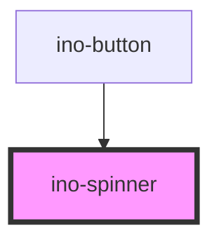

# ino-spinner

<!-- Auto Generated Below -->

## Overview

A component which displays a variety of spinners. Use spinners to show that the app is loading content or performing another process for which the user has to wait.

This component contains three different types of spinners animated with pure CSS. It mainly relies on [Spinkit](http://tobiasahlin.com/spinkit/) and may be extended in future with more types.

## Properties

| Property | Attribute | Description                                                                       | Type                             | Default  |
| -------- | --------- | --------------------------------------------------------------------------------- | -------------------------------- | -------- |
| `height` | `height`  | The height of this spinner (default = 40)                                         | `number`                         | `40`     |
| `modal`  | `modal`   | If true, the spinner is shown as modal over the current app page.                 | `boolean`                        | `false`  |
| `type`   | `type`    | The type of this spinner. Possible values: `tile` (default), `bounce` or `circle` | `"bounce" \| "circle" \| "tile"` | `'tile'` |
| `width`  | `width`   | The width of this spinner (defaul = 40)                                           | `number`                         | `40`     |

## Dependencies

### Used by

 - [ino-button](../ino-button)

### Graph

----------------------------------------------

*Built with [StencilJS](https://stenciljs.com/)*
