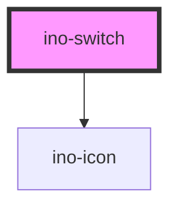

# ino-switch

Input switches toggle the state of a single item. Compared to the input checkbox, their changes usually apply without any additional submission.

## Usage

The component can be used as follows:

### Web Component

```js
document
  .querySelector('ino-switch')
  .addEventListener('checkedChange', (e) =>
    alert(`The checked state is: ${e.detail}`),
  );
```

```html
<ino-switch checked disabled color-scheme="<string>" name="<string>">
  Label
</ino-switch>
```

### React

#### Example #1 - Basic

```js
import { Component } from 'react';
import { InoSwitch } from '@inovex.de/elements-react';

class MyComponent extends Component {
  state = {
    checked: false,
  };

  handleCheckboxClick(e) {
    this.setState({ checked: e.detail });
  }

  render() {
    return (
      <InoSwitch
        checked={this.state.checked}
        onCheckedChange={handleCheckboxClick}
      >
        Apple
      </InoSwitch>
    );
  }
}
```

#### Example #2 - With Types

```js
import React, { Component } from 'react';
import { InoSwitch } from '@inovex.de/elements-react';
import { Components } from '@inovex.de/elements-react/dist/types/components';

const Switch: React.FunctionComponent<Components.InoSwitchAttributes> = (
  props,
) => {
  const { value, onClick, checked } = props;

  return (
    <InoSwitch value={value} onCheckedChange={onClick} checked={checked}>
      {value}
    </InoSwitch>
  );
};

class MyComponent extends Component {
  state = {
    checked: false,
  };

  handleCheckboxClick(e) {
    this.setState({ checked: e.detail });
  }

  render() {
    return (
      <Switch
        value={'Apple'}
        checked={this.state.checked}
        onClick={handleCheckboxClick}
      />
    );
  }
}
```

## Control flow

The input has a controlled (unmanaged) attribute `checked`. For this reason listen to `checkedChange`, sync it with your local state and pass the new value to the component again to change the value.

<!-- Auto Generated Below -->


## Properties

| Property       | Attribute       | Description                                    | Type      | Default     |
| -------------- | --------------- | ---------------------------------------------- | --------- | ----------- |
| `checked`      | `checked`       | Marks this element as checked. (**unmanaged**) | `boolean` | `false`     |
| `disabled`     | `disabled`      | Disables this element.                         | `boolean` | `undefined` |
| `iconLeading`  | `icon-leading`  | Sets the prepended icon                        | `string`  | `undefined` |
| `iconTrailing` | `icon-trailing` | Sets the appended icon                         | `string`  | `undefined` |
| `name`         | `name`          | The name of this element.                      | `string`  | `undefined` |


## Events

| Event           | Description                                                                                                    | Type               |
| --------------- | -------------------------------------------------------------------------------------------------------------- | ------------------ |
| `checkedChange` | Emits when the user clicks on the switch to change the `checked` state. Contains the status in `event.detail`. | `CustomEvent<any>` |


## Slots

| Slot         | Description                                                                       |
| ------------ | --------------------------------------------------------------------------------- |
| `"default"`  | Label of the switch                                                               |
| `"icon-off"` | Icon used for the unchecked state. The colors of the `color-scheme` will be used. |
| `"icon-on"`  | Icon used for the checked state. The colors of the `color-scheme` will be used.   |


## Dependencies

### Depends on

- [ino-icon](../ino-icon)

### Graph


----------------------------------------------

*Built with [StencilJS](https://stenciljs.com/)*
