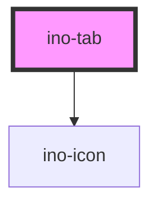

# ino-tab

<!-- Auto Generated Below -->

## Overview

Tabs organize and allow navigation between groups of content that are related and at the same hierarchical level. Each Tab governs the visibility of one group of content. It functions as a wrapper around the material [Tab](https://github.com/material-components/material-components-web/tree/master/packages/mdc-tab) component.

## Properties

| Property                | Attribute                 | Description                                                                                                                                                                                                | Type      | Default     |
| ----------------------- | ------------------------- | ---------------------------------------------------------------------------------------------------------------------------------------------------------------------------------------------------------- | --------- | ----------- |
| `a11yControls`          | `a-1-1y-controls`         | Contains the ID of the associated tab panel for accessibility purposes. This property is optional and used to link the tab to its content panel, adhering to WAI-ARIA practices for the tabpanel role.     | `string`  | `undefined` |
| `a11ySelected`          | `a-1-1y-selected`         | Reflects the selected state of the tab for accessibility purposes. This property is optional and primarily managed by the parent `ino-tab-bar` component, adhering to WAI-ARIA practices for the tab role. | `boolean` | `undefined` |
| `icon`                  | `icon`                    | Indicates a leading icon in the tab.                                                                                                                                                                       | `string`  | `undefined` |
| `indicatorContentWidth` | `indicator-content-width` | Indicates that the tab only expands to the width of its content.                                                                                                                                           | `boolean` | `false`     |
| `label`                 | `label`                   | **[DEPRECATED]**   [DEPRECATED] Please use the default slot instead. Indicates a label text in the tab.                                                             | `string`  | `undefined` |
| `stacked`               | `stacked`                 | Indicates that the tab icon and label should flow vertically instead of horizontally.                                                                                                                      | `boolean` | `false`     |

## Events

| Event        | Description                                                                          | Type               |
| ------------ | ------------------------------------------------------------------------------------ | ------------------ |
| `interacted` | Emitted when the user interacts with the tab. This event is used by the ino-tab-bar. | `CustomEvent<any>` |

## Dependencies

### Depends on

- [ino-icon](../ino-icon)

### Graph

----------------------------------------------

*Built with [StencilJS](https://stenciljs.com/)*
