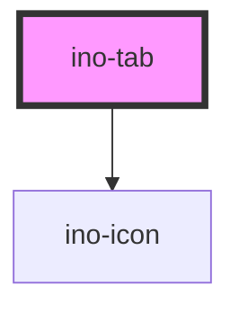

# ino-tab

Tabs organize and allow navigation between groups of content that are related and at the same hierarchical level. Each Tab governs the visibility of one group of content. It functions as a wrapper around the material [Tab](https://github.com/material-components/material-components-web/tree/master/packages/mdc-tab) component.

### Usage

The component can be used as follows:

```html
<ino-tab
  ino-label="<string>"
  ino-icon="<string>"
  ino-indicator-content-width
  ino-stacked
>
</ino-tab>
```

### React

#### Example #1 - Basic

```js
import { Component } from 'react';
import { InoTab, InoTabBar } from '@inovex.de/elements/dist/react';

class MyComponent extends Component {
  render() {
    return (
      <InoTabBar inoActiveTab={2}>
        <InoTab inoLabel="Tab #1" />
        <InoTab inoLabel="Tab #2" />
        <InoTab inoLabel="Tab #3" />
      </InoTabBar>
    );
  }
}
```

#### Example #2 - With Types

```js
import React, { Component } from 'react';
import { InoTab, InoTabBar } from '@inovex.de/elements/dist/react';
import { Components } from '@inovex.de/elements/dist/types/components';

const TabBar: React.FunctionComponent<Components.InoTabBarAttributes> = props => {
  const { inoActiveTab } = props;

  return <InoTabBar inoActiveTab={inoActiveTab}>{props.children}</InoTabBar>;
};

class MyComponent extends Component {
  render() {
    return (
      <TabBar inoActiveTab={2}>
        <InoTab inoLabel="Tab #1" />
        <InoTab inoLabel="Tab #2" />
        <InoTab inoLabel="Tab #3" />
      </TabBar>
    );
  }
}
```

## Additional Hints

**Content**: Provide the text of a Tab and, if desired, an icon of the tab in `ino-icon`.

<!-- Auto Generated Below -->


## Properties

| Property                   | Attribute                     | Description                                                                           | Type      | Default     |
| -------------------------- | ----------------------------- | ------------------------------------------------------------------------------------- | --------- | ----------- |
| `inoIcon`                  | `ino-icon`                    | Indicates a leading icon in the tab.                                                  | `string`  | `undefined` |
| `inoIndicatorContentWidth` | `ino-indicator-content-width` | Indicates that the tab only expands to the width of its content.                      | `boolean` | `false`     |
| `inoLabel`                 | `ino-label`                   | Indicates a label text in the tab.                                                    | `string`  | `undefined` |
| `inoStacked`               | `ino-stacked`                 | Indicates that the tab icon and label should flow vertically instead of horizontally. | `boolean` | `false`     |


## Events

| Event           | Description                                                                          | Type               |
| --------------- | ------------------------------------------------------------------------------------ | ------------------ |
| `inoInteracted` | Emitted when the user interacts with the tab. This event is used by the ino-tab-bar. | `CustomEvent<any>` |


## Dependencies

### Depends on

- [ino-icon](../ino-icon)

### Graph


----------------------------------------------

*Built with [StencilJS](https://stenciljs.com/)*
