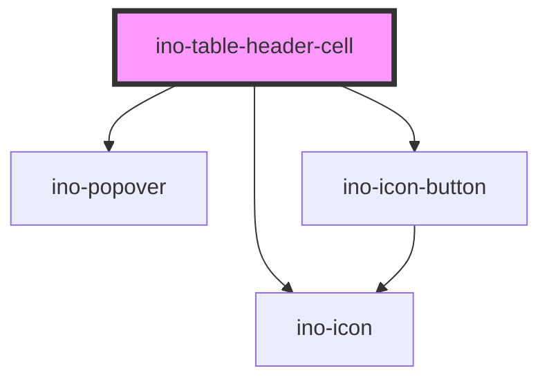

# ino-table-header-cell

The `ino-table-header-cell` is a particular header cell to provide search and column sort behaviour on `ino-table`'s.

## Usage

The component can be used as follows:

```html
<ino-table-header-cell
  column-id="<string>"
  label="<string>"
  search-icon="<string>"
  not-sortable="<boolean>"
  sort-direction="<string>"
  sort-start="asc|desc"
></ino-table-header-cell>
```

## Sorting

Set the `sortable` attribute/property on this column. The feature itself does not provide a sorting algorithm itself but notifies you whenever the user wants to sort
the column in a specific direction. The `sort-direction` shows the current sort direction, the `sort-start` changes the default sort direction.

The element emits a `sortDirectionChange` event which you can handle to implement the sorting behaviour. In most cases, however, it is recommended
let the `ino-table` handle it. Otherwise, you have to implement the logic to reset other columns in the table yourself (which may be useful when you want to sort
for multiple columns).

For the recommended approach, set the `column-id` such that the `ino-table` knows the identity of this column. For more details, see the documentation of `ino-table`.

```html
<tr slot="header-row">
  <ino-table-header-cell
    label="1"
    column-id="column-name"
    sortable
    sort-direction="asc"
  ></ino-table-header-cell>
  <ino-table-header-cell label="Cell content"></ino-table-header-cell>
</tr>
```

## Searching

In order to add a floating column search as popover, add any desired form element as child of this component. The feature itself does not provide a search (or filter) algorithm itself but allows you to render search fields, selection or datepicker within a `ino-popover`. Based on the input, you may want to trigger a search in the backend or filter your elements locally.

The `search-icon` allows you to set an alternative to the default `search`, which may be useful for selections (`list`) or datepickers (`calender`).The slot contains the search input within the popover. In order to indicate to the user that a closed popover search input contains value, i.e. has been searched, set the `searched` property on the table-header-cell.

Use the `data-ino-focus` on popover elements to focus them on load. Currently, `ino-input`, `ino-textarea` and `ino-datepicker` are supported.

> Note: During initial rendering, the component checks for child elements and decides its searchability. However, if you need to change the search behaviour after initial rendering (for instance lazy load the input elements), use the `setSortable` method to update the behaviour.

**Example:**

```html
<ino-table>
  <tr slot="header-row">
    <ino-table-header-cell label="Simple text field">
      <ino-input placeholder="Search for XY..." data-ino-focus>
        <ino-icon
          clickable
          slot="ino-icon-trailing"
          icon="close--dense"
        ></ino-icon>
      </ino-input>
    </ino-table-header-cell>

    <ino-table-header-cell
      label="Column Selection Search"
      search-icon="list"
    >
      <ino-list>
        <ino-list-item text="Option 1"
          ><ino-checkbox
            slot="ino-list-item-leading"
            selection
          ></ino-checkbox
        ></ino-list-item>
        <ino-list-item-divider inset></ino-list-item-divider>
        <ino-list-item text="Option 2"
          ><ino-checkbox
            slot="ino-list-item-leading"
            selection
          ></ino-checkbox
        ></ino-list-item>
        <ino-list-item-divider inset></ino-list-item-divider>
        <ino-list-item text="Option 3"
          ><ino-checkbox
            slot="ino-list-item-leading"
            selection
          ></ino-checkbox
        ></ino-list-item>
        <ino-list-item-divider inset></ino-list-item-divider>
        <ino-list-item text="Option 4"
          ><ino-checkbox
            slot="ino-list-item-leading"
            selection
          ></ino-checkbox
        ></ino-list-item>
        <ino-list-item-divider inset></ino-list-item-divider>
      </ino-list>
    </ino-table-header-cell>
  </tr>
</ino-table>
```

<!-- Auto Generated Below -->


## Properties

| Property        | Attribute        | Description                                                                                                                                                                                             | Type              | Default     |
| --------------- | ---------------- | ------------------------------------------------------------------------------------------------------------------------------------------------------------------------------------------------------- | ----------------- | ----------- |
| `autofocus`     | `autofocus`      | Marks the header as autofocused (used for searchable header cells).  Use this in combination with the `data-ino-focus` attribute on the actual search target element to focus a specific input element. | `boolean`         | `false`     |
| `columnId`      | `column-id`      | A unique identifier of the column (used for sorting).                                                                                                                                                   | `string`          | `undefined` |
| `label`         | `label`          | Name of the column.                                                                                                                                                                                     | `string`          | `undefined` |
| `notSortable`   | `not-sortable`   | If true, the cell is **not** sortable. By default, table header cells are sortable.                                                                                                                     | `boolean`         | `false`     |
| `searchIcon`    | `search-icon`    | Identifier of the search icon (default `search`). Used for date or list search columns.                                                                                                                 | `string`          | `'search'`  |
| `searched`      | `searched`       | True, if the column has been searched for this column. Persistent state to indicate the user that this column has a search filter.                                                                      | `boolean`         | `false`     |
| `sortDirection` | `sort-direction` | The current sort direction of the column.                                                                                                                                                               | `"asc" \| "desc"` | `undefined` |
| `sortStart`     | `sort-start`     | The initial sort direction state (default `desc`).  By default, all columns are sorted descending followed by ascending. To switch this order, set sort Start to asc.                                   | `"asc" \| "desc"` | `'desc'`    |


## Events

| Event                 | Description                                                    | Type                                      |
| --------------------- | -------------------------------------------------------------- | ----------------------------------------- |
| `searchFocusChange`   | Emits that the search field focused (true) or blurred (false). | `CustomEvent<boolean>`                    |
| `sortDirectionChange` | Emits that the sort direction has been changed.                | `CustomEvent<SortDirectionChangeDetails>` |


## Methods

### `setBlur() => Promise<void>`

Sets blur on the header cell. If searchable, closes the popover.

#### Returns

Type: `Promise<void>`


### `setFocus() => Promise<void>`

Sets focus on the header cell.
If searchable, opens the popover and focuses the `data-ino-focus` target.

#### Returns

Type: `Promise<void>`


### `setSearchable(searchable: boolean) => Promise<void>`

Updates the search behaviour of this cell.

#### Returns

Type: `Promise<void>`


## Slots

| Slot        | Description                                                |
| ----------- | ---------------------------------------------------------- |
| `"default"` | The search content (input field, list) within the popover. |


## Dependencies

### Depends on

- [ino-popover](../ino-popover)
- [ino-icon](../ino-icon)
- [ino-icon-button](../ino-icon-button)

### Graph


----------------------------------------------

*Built with [StencilJS](https://stenciljs.com/)*
