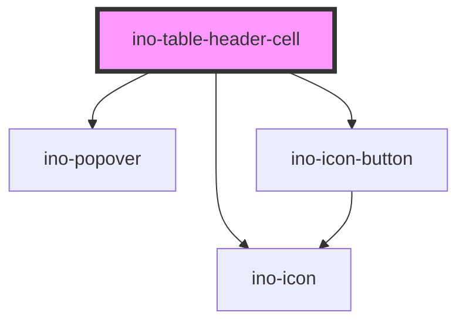

# ino-table-header-cell

<!-- Auto Generated Below -->

## Overview

The `ino-table-header-cell` is a particular header cell to provide search and column sort behaviour on `ino-table`'s.

## Properties

| Property        | Attribute        | Description                                                                                                                                                                                             | Type              | Default     |
| --------------- | ---------------- | ------------------------------------------------------------------------------------------------------------------------------------------------------------------------------------------------------- | ----------------- | ----------- |
| `autofocus`     | `autofocus`      | Marks the header as autofocused (used for searchable header cells).  Use this in combination with the `data-ino-focus` attribute on the actual search target element to focus a specific input element. | `boolean`         | `false`     |
| `columnId`      | `column-id`      | A unique identifier of the column (used for sorting).                                                                                                                                                   | `string`          | `undefined` |
| `label`         | `label`          | Name of the column.                                                                                                                                                                                     | `string`          | `undefined` |
| `notSortable`   | `not-sortable`   | If true, the cell is **not** sortable. By default, table header cells are sortable.                                                                                                                     | `boolean`         | `false`     |
| `searchIcon`    | `search-icon`    | Identifier of the search icon (default `search`). Used for date or list search columns.                                                                                                                 | `string`          | `'search'`  |
| `searched`      | `searched`       | True, if the column has been searched for this column. Persistent state to indicate the user that this column has a search filter.                                                                      | `boolean`         | `false`     |
| `sortDirection` | `sort-direction` | The current sort direction of the column.                                                                                                                                                               | `"asc" \| "desc"` | `undefined` |
| `sortStart`     | `sort-start`     | The initial sort direction state (default `desc`).  By default, all columns are sorted descending followed by ascending. To switch this order, set sort Start to asc.                                   | `"asc" \| "desc"` | `'desc'`    |

## Events

| Event                 | Description                                                    | Type                                      |
| --------------------- | -------------------------------------------------------------- | ----------------------------------------- |
| `searchFocusChange`   | Emits that the search field focused (true) or blurred (false). | `CustomEvent<boolean>`                    |
| `sortDirectionChange` | Emits that the sort direction has been changed.                | `CustomEvent<SortDirectionChangeDetails>` |

## Methods

### `setBlur() => Promise<void>`

Sets blur on the header cell. If searchable, closes the popover.

#### Returns

Type: `Promise<void>`

### `setFocus() => Promise<void>`

Sets focus on the header cell.
If searchable, opens the popover and focuses the `data-ino-focus` target.

#### Returns

Type: `Promise<void>`

### `setSearchable(searchable: boolean) => Promise<void>`

Updates the search behaviour of this cell.

#### Returns

Type: `Promise<void>`

## Slots

| Slot        | Description                                                |
| ----------- | ---------------------------------------------------------- |
| `"default"` | The search content (input field, list) within the popover. |

## Dependencies

### Depends on

- [ino-popover](../ino-popover)
- [ino-icon](../ino-icon)
- [ino-icon-button](../ino-icon-button)

### Graph

----------------------------------------------

*Built with [StencilJS](https://stenciljs.com/)*
