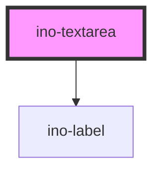

# ino-textarea

A textarea component with styles. It uses a material [textfield](https://github.com/material-components/material-components-web/tree/master/packages/mdc-textfield) component for its styling.

> **Note:** The textarea is always styled in an outlined manner. If you need to use a textarea in combination with other form inputs (`ino-input`), use their respective outline style.

### Usage

The component can be used as follows:

```js
document
  .querySelector('ino-textarea')
  .addEventListener('valueChange', (e) =>
    alert(`The new textarea value is ${e.detail}`),
  );
```

```html
<ino-textarea
  autofocus
  cols="<number>"
  disabled
  maxlength="<number>"
  minlength="<number>"
  name="<string>"
  placeholder="<string>"
  required
  rows="<number>"
  value="<string>"
  autogrow
  ino-label="<string>"
>
</ino-textarea>
```

### React

#### Example #1 - Basic

```js
import { Component } from 'react';
import { InoTextarea } from '@inovex.de/elements/dist/react';

class MyComponent extends Component {
  render() {
    return (
      <InoTextarea autogrow>
        Here's some text. And the textarea will grow when you enter more...
      </InoTextarea>
    );
  }
}
```

#### Example #2 - With Types

```js
import React, { Component } from 'react';
import { InoTextarea } from '@inovex.de/elements/dist/react';
import { Components } from '@inovex.de/elements/dist/types/components';

const Textarea: React.FunctionComponent<Components.InoTextareaAttributes> = (
  props,
) => {
  const { autogrow } = props;

  return <InoTextarea autogrow={autogrow}>{props.children}</InoTextarea>;
};

class MyComponent extends Component {
  render() {
    return (
      <Textarea autogrow>
        Here's some text. And the textarea will grow when you enter more...
      </Textarea>
    );
  }
}
```

## Additional Hints

**Labels**: The component shows a floating label containing the value of `ino-label`.

### Control flow

The textarea has a controlled (unmanaged) attribute `value`. For this reason, the value doesn't change on user interaction but on updates of `value`. Listen to `valueChange`, sync it with your local state and pass the new value to the component again to change value of input.

```js
document.querySelector('ino-textarea').addEventListener('valueChanges', (e) => {
  // ...
});
```

```html
<ino-textarea
  value={this.state.value}
  valueChange={e => this.state.value = e.detail}>
</ino-textarea>
```

### Event Behaviour

The component is based on a native input with additional features. Thus, the component bubbles events triggered by the native [HTMLTextareaElement](https://developer.mozilla.org/en-US/docs/Web/API/HTMLTextAreaElement) like `keyup`. The native `input` and `change` event is not bubbled because the value will only change when the value attribute changes.

<!-- Auto Generated Below -->


## Properties

| Property               | Attribute                | Description                                                                                                                                                                                                                                                                                               | Type      | Default     |
| ---------------------- | ------------------------ | --------------------------------------------------------------------------------------------------------------------------------------------------------------------------------------------------------------------------------------------------------------------------------------------------------- | --------- | ----------- |
| `autoFocus`            | `autofocus`              | The autofocus of this element.                                                                                                                                                                                                                                                                            | `boolean` | `undefined` |
| `autogrow`             | `autogrow`               | An optional flag to allow the textarea adjust its height to display all the content. The `rows` attribute can also be used to specify a minimum height. Use CSS to specify a max-height for the textarea element. Once the height exceeds the max-height, autogrow will re-enable the vertical scrollbar. | `boolean` | `false`     |
| `cols`                 | `cols`                   | The number of cols of this textarea.                                                                                                                                                                                                                                                                      | `number`  | `undefined` |
| `disabled`             | `disabled`               | Disables this element.                                                                                                                                                                                                                                                                                    | `boolean` | `undefined` |
| `inoLabel`             | `ino-label`              | The optional floating label of this input field.                                                                                                                                                                                                                                                          | `string`  | `undefined` |
| `inoOutline`           | `ino-outline`            | Styles the input field as outlined element.                                                                                                                                                                                                                                                               | `boolean` | `undefined` |
| `inoShowLabelHint`     | `ino-show-label-hint`    | If true, an *optional* message is displayed if not required, otherwise a * marker is displayed if required                                                                                                                                                                                                | `boolean` | `undefined` |
| `maxlength`            | `maxlength`              | The max length of this element.                                                                                                                                                                                                                                                                           | `number`  | `undefined` |
| `minlength`            | `minlength`              | The min length of this element.                                                                                                                                                                                                                                                                           | `number`  | `undefined` |
| `name`                 | `name`                   | The name of this element.                                                                                                                                                                                                                                                                                 | `string`  | `undefined` |
| `placeholder`          | `placeholder`            | The placeholder of this element.                                                                                                                                                                                                                                                                          | `string`  | `undefined` |
| `required`             | `required`               | Marks this element as required.                                                                                                                                                                                                                                                                           | `boolean` | `undefined` |
| `rows`                 | `rows`                   | The number of rows of this textarea.                                                                                                                                                                                                                                                                      | `number`  | `undefined` |
| `showCharacterCounter` | `show-character-counter` | Displays the number of characters. The maxlength-property must be set.                                                                                                                                                                                                                                    | `boolean` | `undefined` |
| `value`                | `value`                  | The value of this element. (**unmanaged**)                                                                                                                                                                                                                                                                | `string`  | `''`        |


## Events

| Event         | Description                                                                    | Type                  |
| ------------- | ------------------------------------------------------------------------------ | --------------------- |
| `inoBlur`     | Emits when the textarea is blurred and validates email input                   | `CustomEvent<void>`   |
| `valueChange` | Emits when the user types something in. Contains typed input in `event.detail` | `CustomEvent<string>` |


## CSS Custom Properties

| Name                           | Description                   |
| ------------------------------ | ----------------------------- |
| `--ino-textarea-caret-color`   | color of the caret            |
| `--ino-textarea-label-color`   | color of the label            |
| `--ino-textarea-outline-color` | outline color of the textarea |


## Dependencies

### Depends on

- [ino-label](../ino-label)

### Graph


----------------------------------------------

*Built with [StencilJS](https://stenciljs.com/)*
