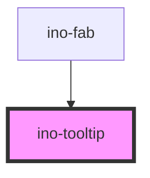

# ino-tooltip

A tooltip component that displays text when users hover over, focus on, or tap an element.

> Note: A tooltip can only display plain text. For more complex dialogs, see the [Popover](https://elements.inovex.de/dist/latest/storybook/?path=/story/notification-ino-popover--default-usage) component.

### Usage

The component can be used as follows:

```html
<ino-tooltip
  for="<string>"
  label="<string>"
  placement="<string>"
  trigger="<string>"
>
  Any desired HTML
</ino-tooltip>
```

### React

#### Example #1 - Basic

```js
import { Component } from 'react';
import { InoButton, InoTooltip } from '@inovex.de/elements/dist/react';

class MyComponent extends Component {
  render() {
    return (
      <InoButton id="tooltip-button">Hover me to see the Tooltip!</InoButton>
      <InoTooltip inoFor="tooltip-button" inoLabel="This is the tooltip!" inoPlacement="top" inoTrigger="hover" />
    );
  }
}
```

#### Example #2 - With Types

```js
import React, { Component } from 'react';
import { InoButton, InoTooltip } from '@inovex.de/elements/dist/react';
import { Components } from '@inovex.de/elements/dist/types/components';

const Tooltip: React.FunctionComponent<Components.InoTooltipAttributes> = props => {
  const { inoPlacement, inoTrigger, inoFor, inoLabel } = props;

  return <InoTooltip inoFor={inoFor} inoLabel={inoLabel} inoPlacement={inoPlacement} inoTrigger={inoTrigger}>{props.children}</InoTooltip>
};

class MyComponent extends Component {
  render() {
    return (
      <InoButton id="tooltip-button">Hover me to see the Tooltip!</InoButton>
      <Tooltip inoFor="tooltip-button" inoLabel="This is the tooltip!" inoPlacement="top" inoTrigger="hover" />
    );
  }
}
```

## Additional Hints

<!-- Auto Generated Below -->


## Properties

| Property      | Attribute      | Description                                                                                                                                | Type                                                                                                                                                                                                                                                                                                                                   | Default              |
| ------------- | -------------- | ------------------------------------------------------------------------------------------------------------------------------------------ | -------------------------------------------------------------------------------------------------------------------------------------------------------------------------------------------------------------------------------------------------------------------------------------------------------------------------------------- | -------------------- |
| `colorScheme` | `color-scheme` | Sets the color scheme of the tooltip Valid options include: `primary`, `transparent`                                                       | `"primary" \| "transparent"`                                                                                                                                                                                                                                                                                                           | `'primary'`          |
| `for`         | `for`          | The target id the tooltip belongs to. If not given, the tooltip is attached to the parent component.                                       | `string`                                                                                                                                                                                                                                                                                                                               | `undefined`          |
| `label`       | `label`        | <span style="color:red">**[DEPRECATED]**</span> <br/><br/>The text shown in the tooltip.  [DEPRECATED] Please use the default slot instead | `string`                                                                                                                                                                                                                                                                                                                               | `undefined`          |
| `placement`   | `placement`    | The placement of the tooltip. Accepted values: `top(-start, -end)`, `right(-start, -end)`, `bottom(-start, -end)`, `left(-start, -end)`    | `"auto" \| "auto-end" \| "auto-start" \| "bottom" \| "bottom-end" \| "bottom-start" \| "left" \| "left-end" \| "left-start" \| "right" \| "right-end" \| "right-start" \| "top" \| "top-end" \| "top-start"`                                                                                                                           | `'auto'`             |
| `trigger`     | `trigger`      | The trigger to show the tooltip - either `click`, `hover` or `focus`. Multiple triggers possible by separating them with a space.          | `"click focus mouseenter" \| "click focus" \| "click mouseenter focus" \| "click mouseenter" \| "click" \| "focus click mouseenter" \| "focus click" \| "focus mouseenter click" \| "focus mouseenter" \| "focus" \| "mouseenter click focus" \| "mouseenter click" \| "mouseenter focus click" \| "mouseenter focus" \| "mouseenter"` | `'mouseenter focus'` |


## Methods

### `getTippyInstance() => Promise<any>`

Returns the internally used tippy.js instance
For more informations see: https://atomiks.github.io/tippyjs/

#### Returns

Type: `Promise<any>`


## Slots

| Slot                                       | Description |
| ------------------------------------------ | ----------- |
| `"default The text shown in the tooltip."` |             |


## Dependencies

### Used by

 - [ino-fab](../ino-fab)

### Graph


----------------------------------------------

*Built with [StencilJS](https://stenciljs.com/)*
