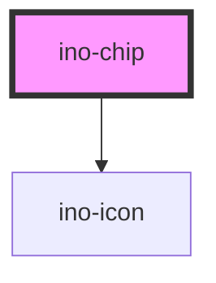

# ino-chip

A compact component that contains contents and icons styled as chip.

> A chip **always** has to be composed by an `ino-chip-set` component.

## Usage

The component can be used as follows:

### Web Component

```js
document
  .querySelector('ino-chip')
  .addEventListener('removeChip', e =>
    console.log('This chip will be removed', e.detail)
  );
```

```html
<ino-chip
  ino-color-scheme="<string>"
  ino-fill="<string>"
  ino-icon="<string>"
  ino-label="<string>"
  ino-removable
  ino-selectable
  ino-selected
  ino-value="<string>"
>
</ino-chip>
```

### React

#### Example #1 - Basic

```js
import { Component } from 'react';
import { InoChipSet, InoChip } from '@inovex/elements/dist/react';

class MyComponent extends Component {
  chipsetSelectionChange(e: any) {
    console.log(
      e.detail === true
        ? 'The last one was toggled'
        : `User clicked: ${e.detail}`
    );
  }

  render() {
    return (
      <InoChipSet
        inoType="choice"
        onUpdateChipSet={this.chipsetSelectionChange}
      >
        <InoChip inoValue="apple" inoLabel="Apple" />
        <InoChip inoValue="banana" inoLabel="Banana" />
        <InoChip inoValue="cherry" inoLabel="Cherry" />
      </InoChipSet>
    );
  }
}
```

#### Example #2 - With Types

```js
import React, { Component } from 'react';
import { InoChipSet, InoChip } from '@inovex/elements/dist/react';
import { Components } from '@inovex/elements/dist/types/components';

const ChipSet: React.FunctionComponent<Components.InoChipSetAttributes> = props => {
  const { inoType } = props;

  const chipsetSelectionChange = (e: any) => {
    console.log(
      e.detail === true
        ? 'The last one was toggled'
        : `User clicked: ${e.detail}`
    );
  };

  return (
    <InoChipSet inoType={inoType} onUpdateChipSet={chipsetSelectionChange}>
      <InoChip inoValue="apple" inoLabel="Apple" />
      <InoChip inoValue="banana" inoLabel="Banana" />
      <InoChip inoValue="cherry" inoLabel="Cherry" />
    </InoChipSet>
  );
};

class MyComponent extends Component {
  render() {
    return <ChipSet inoType="choice" />;
  }
}
```

## Additional Hints

**Content**: Provide the text of a chip the slot and, if desired, an icon on the left side of the chip in `ino-icon`.

**Styling**: The chip can be styled in different ways with the attributes `ino-fill` and `ino-color-scheme`. See their attribute documentation below for more informations.

### Removable chips

If `ino-removable` is set to `true`, the chip can be removed by the user. The component then displays a small `close` icon right after the text.

However, the component doesn't hide/destroy itself but emits an `removeChip`-Event instead. Thus, the overlying app can remove the chip by listening to this event.

## Demo

<!-- Auto Generated Below -->


## Properties

| Property         | Attribute          | Description                                                                                                                                                                                             | Type                                                                                               | Default     |
| ---------------- | ------------------ | ------------------------------------------------------------------------------------------------------------------------------------------------------------------------------------------------------- | -------------------------------------------------------------------------------------------------- | ----------- |
| `inoColorScheme` | `ino-color-scheme` | The name of the color scheme which is used to style the background and outline of this component. Possible values: `primary`,  `secondary`, `tertiary`, `success`, `warning`, `error`, `light`, `dark`. | `"dark" \| "error" \| "light" \| "primary" \| "secondary" \| "success" \| "tertiary" \| "warning"` | `undefined` |
| `inoFill`        | `ino-fill`         | The fill type of this element. Possible values: `solid` (default) or `outline`.                                                                                                                         | `"outline" \| "solid"`                                                                             | `'solid'`   |
| `inoIcon`        | `ino-icon`         | The icon before the label in this chip.                                                                                                                                                                 | `string`                                                                                           | `undefined` |
| `inoLabel`       | `ino-label`        | The label of this chip (**required**).                                                                                                                                                                  | `string`                                                                                           | `undefined` |
| `inoRemovable`   | `ino-removable`    | Adds a close icon on the right side of this chip.  If applied, emits the `removeChip` event.                                                                                                            | `boolean`                                                                                          | `undefined` |
| `inoSelectable`  | `ino-selectable`   | Adds a checkmark if the icon is selected.                                                                                                                                                               | `boolean`                                                                                          | `undefined` |
| `inoSelected`    | `ino-selected`     | Marks this element as selected.                                                                                                                                                                         | `boolean`                                                                                          | `undefined` |
| `inoValue`       | `ino-value`        | The value of this chip.  **Required** for chips as part of sets of type `filter` or `choice`.                                                                                                           | `string`                                                                                           | `undefined` |


## Events

| Event        | Description                                                                                                                                                              | Type               |
| ------------ | ------------------------------------------------------------------------------------------------------------------------------------------------------------------------ | ------------------ |
| `removeChip` | Event that emits as soon as the user removes this chip.  Listen to this event to hide or destroy this chip. The event only emits if the property `inoRemovable` is true. | `CustomEvent<any>` |


## Dependencies

### Depends on

- [ino-icon](../ino-icon)

### Graph


----------------------------------------------

*Built with [StencilJS](https://stenciljs.com/)*
