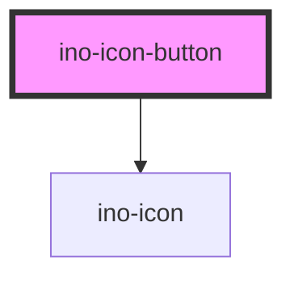

# ino-icon-button

A rounded button component that contains an icon. It functions as a wrapper around the material [icon-button](https://github.com/material-components/material-components-web/tree/master/packages/mdc-icon-button) component.

### Usage

The component can be used as follows:

```js
document
  .querySelector('ino-icon-button')
  .addEventListener('click', _ => alert('The icon button was clicked'));
```

```html
<ino-icon-button
  autofocus
  disabled
  ino-color-scheme="<string>"
  ino-icon="<string>"
>
</ino-icon-button>
```

### React

#### Example #1 - Basic

```js
import { Component } from 'react';
import { InoIconButton } from '@inovex/elements/dist/react';

class MyComponent extends Component {
  handleClick = (e: any) => {
    alert(`IconButton was clicked`);
  };

  render() {
    return <InoIconButton inoIcon="search" onClick={handleClick} />;
  }
}
```

#### Example #2 - With Types

```js
import React, { Component } from 'react';
import { InoIconButton } from '@inovex/elements/dist/react';
import { Components } from '@inovex/elements/dist/types/components';

const IconButton: React.FunctionComponent<Components.InoIconButtonAttributes> = props => {
  const { inoIcon } = props;

  const handleClick = (e: any) => {
    alert(`IconButton was clicked`);
  };

  return (
    <InoIconButton inoIcon={inoIcon} onClick={handleClick}>
      {props.children}
    </InoIconButton>
  );
};

class MyComponent extends Component {
  render() {
    return <IconButton inoIcon="search" />;
  }
}
```

## Additional Hints

**Toggle Button**: To use the ino-icon-button as a toggle button the user can listen to the native `click`-Event and change the icon in `ino-icon`-Attribute.

### Native Events

The component bubbles the native `click`-Event to the user.

<!-- Auto Generated Below -->


## Properties

| Property         | Attribute          | Description                                                                                                                                                                                                       | Type                                                                                               | Default     |
| ---------------- | ------------------ | ----------------------------------------------------------------------------------------------------------------------------------------------------------------------------------------------------------------- | -------------------------------------------------------------------------------------------------- | ----------- |
| `autofocus`      | `autofocus`        | Sets the autofocus for this element.                                                                                                                                                                              | `boolean`                                                                                          | `undefined` |
| `disabled`       | `disabled`         | Disables this element.                                                                                                                                                                                            | `boolean`                                                                                          | `undefined` |
| `inoColorScheme` | `ino-color-scheme` | The name of the color scheme which is used to style the background and outline of this component. Possible values: `primary` (default),  `secondary`, `tertiary`, `success`, `warning`, `error`, `light`, `dark`. | `"dark" \| "error" \| "light" \| "primary" \| "secondary" \| "success" \| "tertiary" \| "warning"` | `'primary'` |
| `inoIcon`        | `ino-icon`         | The name of the icon of this element.                                                                                                                                                                             | `string`                                                                                           | `undefined` |


## Dependencies

### Depends on

- [ino-icon](../ino-icon)

### Graph


----------------------------------------------

*Built with [StencilJS](https://stenciljs.com/)*
